# A Quick Start Guide of Formula One (2021 Season)

This guide includes some of the most important knowledge and concepts that I think is necessary for a new fan to understand what's going on and enjoy the sport. I also added some personal twists and extra stuff that I think is interesting to read. This is because from a sporting sense, F1 is by no means very complex: it's just driving cars, fast! Dramatic crashes and overtakes! The sport itself should be relatively easy to pick up. However, as you can imagine, from a technical standpoint F1 cars are engineering marvels. Each team hires hundreds of the best aerodynamicists, material scientists and engineers in the world, then spends hundreds of millions of dollars developing and producing each year's cars.

If you just wanted to experience the sport and the spectacle, you only need to read Chapters 1 to 3. If you want to learn about some of the details, that will be Chapters 4 to 6. Finally, Chapter 7 is basically how I search for F1 related content. Recommend you to take a peek at that as well.

I'm not a huge history guy, so I didn't include anything related to the early history of F1. Everything here pretty much dates back only to when I started following F1, which is around 2016. You'll quickly learn the big names and famous stories if you decide to start following.

Hope you enjoy!

## The Best Way to Enjoy F1

People often joke to me like motorsports are just cars running in circles. I mean yes that's true, but that really only scratched the surface. Everyone drives road cars, but motorsports is a whole different beast because it's about driving to the limit. Pinning the throttle as early as possible, braking as late as possible, fighting with another driver wheel-to-wheel even if he's running you out of road - all something you apparently can't do in a road car. It is this sensation of driving on the edge of losing control that's very addictive. That's why I think the best way to enjoy F1 or any other motorsport, is to put yourself in the drivers' shoes, imagine you're the one driving at literally breakneck speeds and fighting with other drivers. Release your inner speed demon. This has brought me immense exhilaration and enjoyment over the past few years and I hope you can experience it too.

## Contents

1. [**Championship and Event Format**](#championship-and-event-format)
1. [**The Teams**](#the-teams)
1. [**The Drivers**](#the-drivers)
1. [**The Cars**](#the-cars)
1. [**A Few More Technical Concepts**](#more-technical-concepts)
1. [**More F1-related Content**](#more-f1-related-content)
<!-- 1. [**News in the Paddock**](#news-in-the-paddock) -->

## Championship and Event Format

The **FIA Formula One World Championship** runs annually from around mid-March to late-November or early-December. F1 is considered the pinnacle of motorsport and its popularity around the world ranks only behind the Olympic Games and the World Cup.

F1 is sanctioned by the [Fédération Internationale de l'Automobile](https://en.wikipedia.org/wiki/Fédération_Internationale_de_l'Automobile) (FIA), based in Paris, France.

The typical schedule for recent years consists of 21~23 race events, called "Grand Prix". The Grands Prix usually run every two weeks, but there are some back-to-back race weeks, as well as a month-long summer break in August. These event happen across the world in 20+ countries in Europe, the Americas, Asia and Oceania.

Currently 10 teams participate in the Championship, each team with 2 drivers. Teams are also called *constructors* because they design and construct their own cars each year.

Every Grand Prix happens from Friday to Sunday of the race week. The sessions are:

- Free Practice 1 (FP1, 90 minutes long) and Free Practice 2 (FP2, 90 minutes long) on Friday
- Free Practice 3 (FP3, 60 minutes long) and Qualifying on Saturday
- Race on Sunday

### Free Practice Sessions

The 3 Practice sessions have very little effect on the race results (unless, say, someone crashed the car late in FP3 and the mechanics couldn't get the car repaired for Qualifying). Teams fiddle with the setup of the car, such as wing and suspension angles, gear ratios and stuff, but these are of course confidential.

I hardly ever watch practice sessions live. I simply check the timesheets after each session.

### Qualifying

Qualifying, or "quali" for short, is to determine the starting positions (i.e. the "grid") for the Sunday race.

Qualifying is very much like a sprint: each driver tries to **set one quick lap time**. Only the fastest lap of each driver are compared, slower laps are ignored.

The drivers have multiple shots of doing so in each of these three smaller sections:

- Q1 (18 mins), all 20 drivers participate. The slowest 5 drivers (P16 to P20) are eliminated and cannot participate in Q2 and Q3. These drivers' starting grid positions are set.
- Q2 (15 mins), top 15 drivers from Q1 participate. The slowest 5 drivers (P11 to P15) are eliminated and cannot participate in Q3. These drivers' starting grid positions are also set.
- Q3 (12 mins), top 10 drivers from Q2 participate. This shootout determines the starting grid positions for P1 to P10. P1 is called "Pole Position".

### Race

The Race is, of course, the glamorous main event of every race weekend.

The race runs for a set number of laps (different for each circuit) but the total race distance for each race is always a little bit over 300km (186 mi) with one exception: the Monaco Grand Prix. The races generally take around 75 to 90 minutes to complete, barring any severe incidents causing stoppages.

Championship points are awarded to the drivers and teams each race based on race results:

| Finishing Position | P1   | P2   | P3   | P4   | P5   | P6   | P7   | P8   | P9   | P10  |
| ------------------ | ---- | ---- | ---- | ---- | ---- | ---- | ---- | ---- | ---- | ---- |
| Points             | 25   | 18   | 15   | 12   | 10   | 8    | 6    | 4    | 2    | 1    |

Also, the driver who does the **fastest lap in the race** will be awarded 1 extra point, but only if he finishes in the top 10.

The **Driver's World Champion** is whoever scores the most points over the season. Each team's points are the sum of the points of their drivers. The **Constructor's World Champion** is whichever team that scores the most points. That's pretty much it, no playoffs or any kind of all-star events like in North American sports.

### Side Notes

* Pole position, race win, and podium finish (top-3) are all very noteworthy achievements in a driver's F1 career.
* The grid positions may be changed after qualifying. If a driver or team violated the sporting regulations, such as blocking other drivers on the track, changing a car part that they're not allowed to change, etc., they may be penalized in the form of dropping places on the starting grid. Similarly, drivers can get penalized during the race if they caused a collision, cut corners, forced other drivers off track, etc. The penalties include adding a few seconds to your race time, forcing you to drive through the pitlane (which has a speed limit), or even disqualification.
* All drivers have to do one mandatory pitstop during the race. F1 bans refueling during the race, so pitstops are pretty much only used to change tyres or front wings (if the wing is broken). A typical F1 pitstop nowadays takes only 2.5 seconds. Anything more than 3 to 4 seconds is pretty bad. The best pit crews are sometimes able to do sub-2 second pitstops.
* When incidents happen during the race, say there's been a crash and there's debris on track or a broken barrier, the FIA will deploy the Safety Car which all cars must follow and bunch up behind. No overtakes are allowed and all cars drive at a much lower speed than normal race speeds, then the track workers (called "marshals") can have a safe gap to clean up the mess. This year's Safety Car duties will be shared between two absolutely stunning vehicles: the Mercedes AMG GT R, and (perhaps your favorite) the Aston Martin Vantage.  
  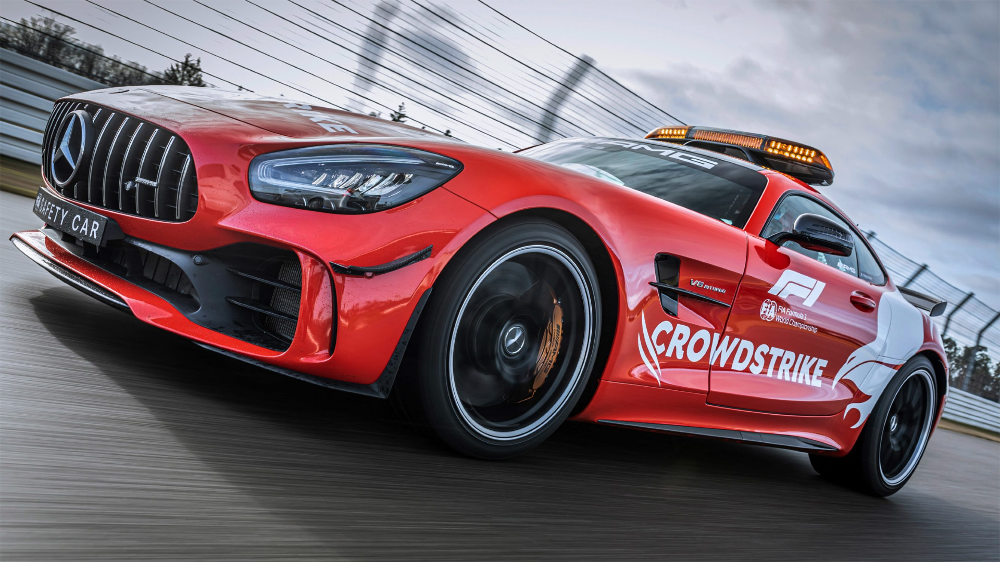
  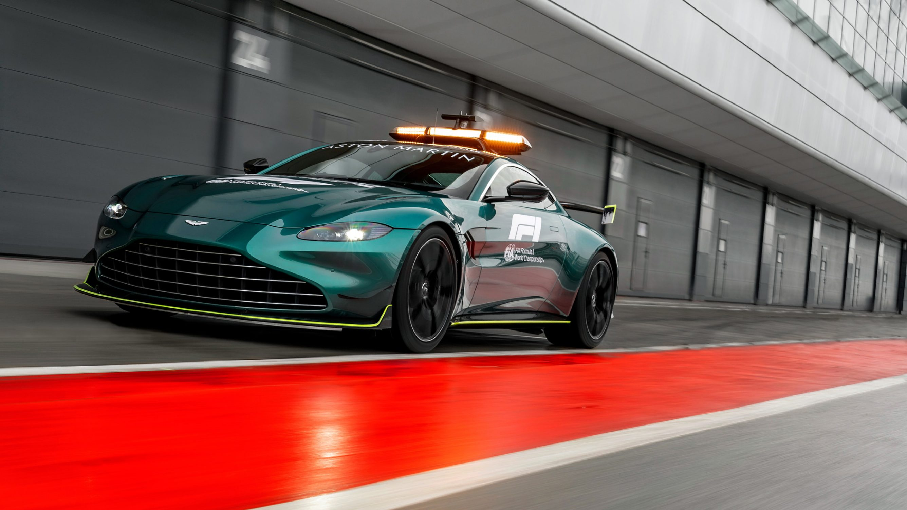

## The Teams

The 10 teams are, of course, where all the stories revolve around. There are the famous ones with a long history such as Ferrari and McLaren, and newcomers (relatively speaking) like Red Bull and Haas. Here is a quick rundown of all the teams.

### The Big Three

#### Mercedes

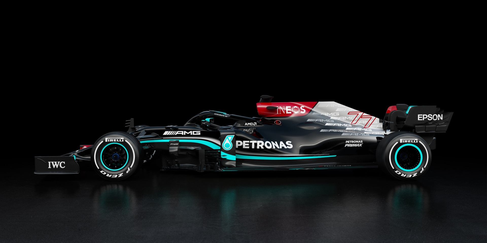

Drivers for 2021: [Lewis Hamilton (#44)](#lewis-hamilton-44), [Valtteri Bottas (#77)](#valtteri-bottas-77)

2020 Constructor's Standing: 1st

The all-conquering, dominant Mercedes team has been the team to beat for the past few years. They are double World Champions (Constructor and Driver) 7 seasons in a row (2014-2020), and are still favorites coming into the 2021 season. They have a superb team that developed the best power units and fastest cars of this era. They have Lewis Hamilton, one of the best drivers in F1 history, to drive for them. It's *almost* like they are unbeatable, since they hardly make any mistakes during the race. However, in the past couple of seasons, a trend seems to be developing that when they actually do make mistakes, they make huge ones, which produced several truly thrilling and memorable races (['19 German GP](https://www.youtube.com/watch?v=RYHQmBULhLc), ['20 Italian GP](https://www.youtube.com/watch?v=TB5yhZdF8SI), ['20 Sakhir GP](https://www.youtube.com/watch?v=H0zwR2drgV4)).

Because of their dominance (and maybe also their black livery) they are often seen as the villains and antagonists that everyone wants to beat.

#### Ferrari

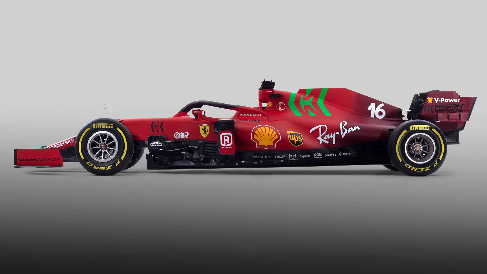

Drivers for 2021: [Charles Leclerc (#16)](#charles-leclerc-16), Carlos Sainz Jr. (#55)

2020 Constructor's Standing: 6th

The famous red car. Ferrari is the team with the longest history in F1, and also the most success. It's often said that other teams such as Mercedes participate in F1 to help advertise and sell their road cars, but Ferrari sells road cars to fund their participation in F1. Such is their dedication to the sport over the many decades. However, for the past dozen years they have not had Championship success. They won their last Driver's and Constructor's Champion all the way back in 2007. They were usually able to stay Top-3 in the Constructor's standings, and were even able to challenge Mercedes from 2017 to 2019, but a series of driver errors and strategic mistakes during the race sank their championship hopes. Fans joke that it's all part of the "Ferrari master plan".

2020 Season wasn't kind to them as their car performance dropped significantly, mostly because they broke regulations with their power unit and got caught. It's difficult to see them return to Top-3 in 2021, but their fans (called the "Tifosi") are still extremely passionate as always.

#### Red Bull Racing

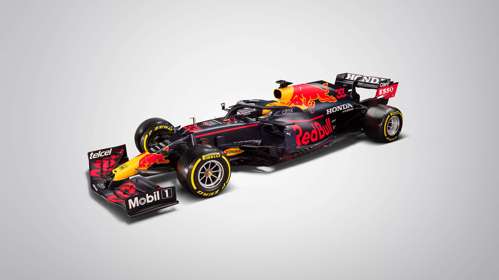

Drivers for 2021: [Max Verstappen (#33)](#max-verstappen-33), [Sergio Perez (#11)](#sergio-perez-11)

2020 Constructor's Standing: 2nd

My favorite team in F1. They are the fun-loving cool guys and mavericks of the F1 grid. Funded by a "fizzy drinks" company, not a lot of people thought they would succeed when they joined F1 in 2005, but they did, winning 4 consecutive double World Champions from 2010 to 2013. Like Ferrari, they were able to stay competitive over the years. They were unable to challenge Mercedes recently, mostly because of weaker power units, which is not their fault because they did not develop the PUs (more on that [later](#power-unit)). Even with a weaker car, they are able to grab race wins from Mercedes or Ferrari because of their excellent execution during the race. They also have a very good young driver's development program which produced multiple F1 superstars currently on the grid (Verstappen, Vettel, Ricciardo).

### The Midfield

#### McLaren

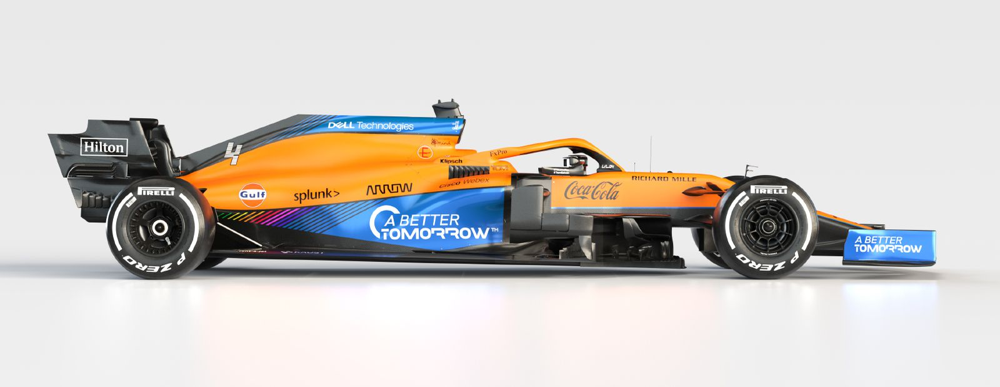

Drivers for 2021: [Daniel Ricciardo (#3)](#daniel-ricciardo-3), [Lando Norris (#4)](#lando-norris-4)

2020 Constructor's Standings: 3rd

McLaren is also one of the more historical teams in F1. Senna, Lewis Hamilton and many other Championship-winning drivers used to drive for them. They've had a few really tough years around 2015-2018, but thanks to a major shake up in the team and driver changes, they recovered their form in the past two seasons and should continue to improve this year. They currently have arguably the most popular driver line up in Ricciardo and Norris. Both drivers are very funny and lovable, and able to get the job done on track. I consider McLaren my second favorite team and always love to see them succeed.

#### Aston Martin

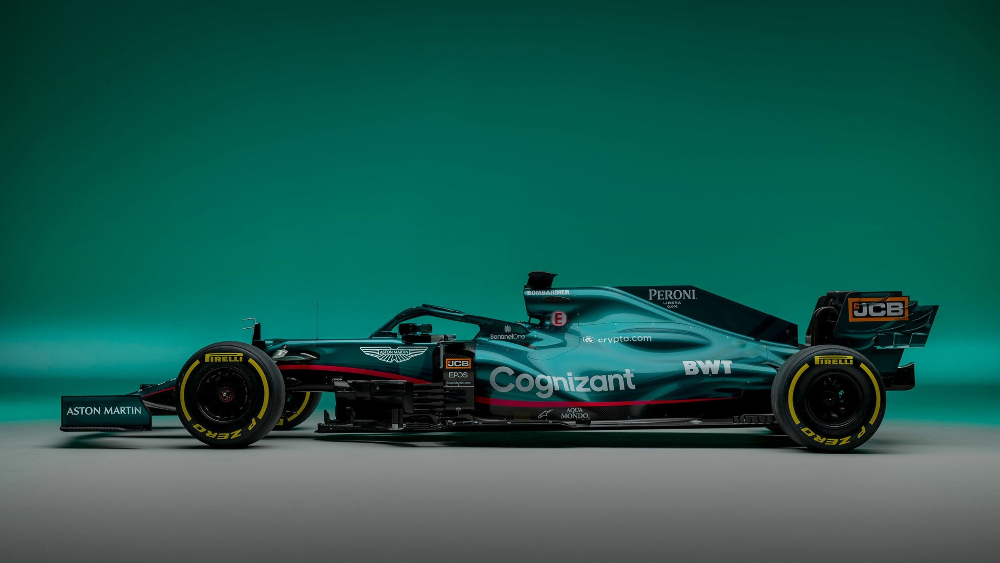

Drivers for 2021: [Sebastian Vettel (#5)](#sebastian-vettel-5), Lance Stroll (#18)

2020 Constructor's Standings: 4th

The newly re-branded Aston Martin team gone through several ownership changes recently. Previously called Force India (owned by an Indian businessman), then Racing Point for the past couple of seasons after Canadian billionaire Lawrence Stroll took over. Lawrence Stroll then became a major shareholder of the Aston Martin company and decided to turn the Racing Point team into this Aston Martin team.

They have mostly been a decent midfield team, occasionally able to pick up a few podiums. In 2020 they suddenly became quite competitive, but people are quick to notice they borrowed or copied a lot of the design concepts from the 2019 championship-winning Mercedes, earning them a rather funny name of "Tracing Point". They brought in 4-time World Champion, veteran driver Sebastian Vettel for this season, competing alongside Lance Stroll who is the son of Lawrence Stroll. Technically Lance's billionaire dad bought him this F1 seat, but I think Lance is actually an okay driver and people are sometimes too harsh on him.

#### Alpine

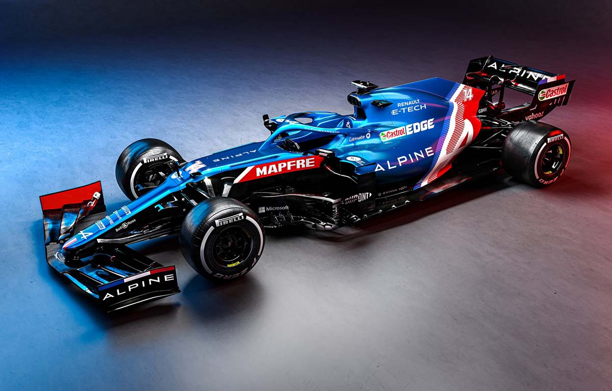

Drivers for 2021: [Fernando Alonso (#14)](#fernando-alonso-14), Esteban Ocon (#31)

2020 Constructor's Standings: 5th

Alpine is basically just Renault. They have been called Renault for most of their history, and only changed the name this year to promote Renault's sports car brand Alpine.

They have had occasional championship success over the years, most notably in 2005-2006 with Fernando Alonso, but most of the time just a midfield team, not too good and not too bad. They should remain in the midfield in 2021.

The one thing I'm really looking forward about Alpine is Guanyu Zhou, a young Chinese driver from Shanghai, is the top prospect in their development system. Zhou currently races in Formula 2, the lower level feeder series of F1. Seems like Alpine is quite determined to get him into F1 in the next few years, because Zhou is a pretty decent driver and can bring tons of sponsor money from China.

#### AlphaTauri

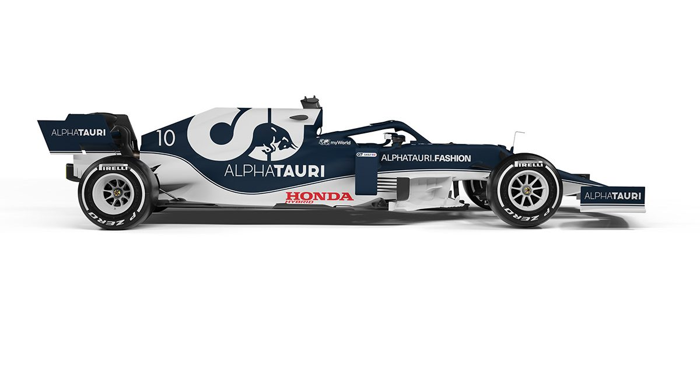

Drivers for 2021: [Pierre Gasly (#10)](#pierre-gasly-10), Yuki Tsunoda (#22)

2020 Constructor's Standings: 7th

AlphaTauri is also owned by the Red Bull group. It is previously called Toro Rosso, which is just "Red Bull" in Italian (the team is based in Faenza, Italy). They can be considered as the junior team to Red Bull. They would put young drivers who graduated from their development program into AT first, and promote to Red Bull if they performed well. Gasly and Tsunoda are both from Red Bull's development program. However, since they are still different teams, Red Bull and AT develop their cars separately, but they do share the same engine manufacturer: Honda. AT (and Toro Rosso previously) never had any championship success, but that's not their main purpose anyway. They did have two miracle race wins which are really great stories (['08 Italian GP](https://www.youtube.com/watch?v=03sUrwIBQb0), ['20 Italian GP](https://www.youtube.com/watch?v=TB5yhZdF8SI)), both are their home races too!

### The Backmarkers

#### Alfa Romeo

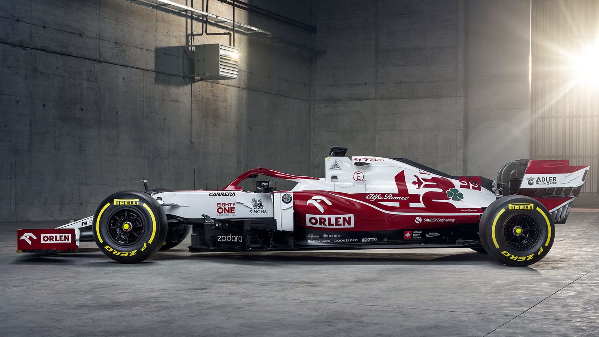

Drivers for 2021: [Kimi Raikkonen (#7)](#kimi-raikkonen-7), Antonio Giovinazzi (#99)

2020 Constructor's Standings: 8th

Alfa Romeo is not the biggest name in F1 and they've not had any championships in the not-so-many seasons they participated. They often run close to the back of the field and are not too much of a focus for the TV cameras. I don't know much about them, but they do have a really pretty livery and a very popular driver Kimi Raikkonen.

#### Haas

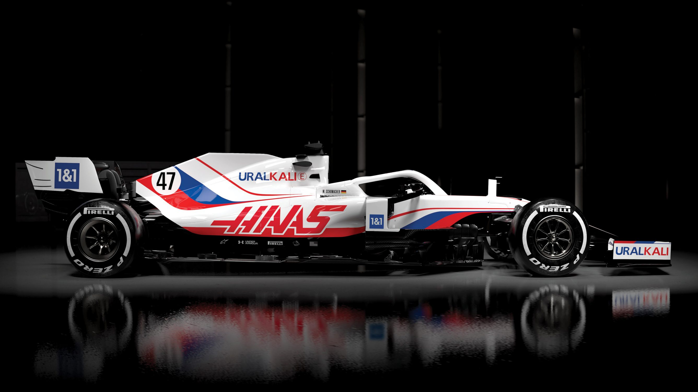

Drivers for 2021: Mick Schumacher (#47), Nikita Mazepin (#9)

2020 Constructor's Standings: 9th

Looking at this huge Russian flag livery you really wouldn't believe me that Haas is an American F1 team, but it is. It's owned by Gene Haas who runs Haas Automation. Haas only has 5 years of history and has not been very successful, but that's not the major talking point about this team. Their previous drivers are often fighting each other, creating much drama and tension. They have a funny-tempered team principal who curses all the time (exhibit [1](https://www.youtube.com/watch?v=W5WVVls74mI) and [2](https://www.youtube.com/watch?v=q6dFnuqHY10)). They have been involved in a couple of really shady sponsorship deals. This year they are going with two rookie drivers which is usually not the best thing to do. Mick Schumacher is the son of the great Michael Schumacher and everybody loves him. Mazepin however, is quite the d*ckhead to say the least, but he is the one bringing all the Russian money which influenced the color scheme of the car. Just... a very weird team.

#### Williams

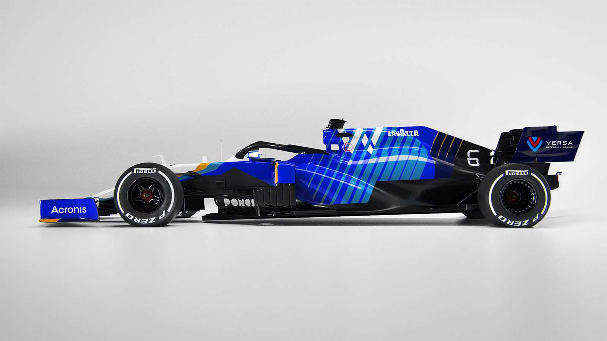

Drivers for 2021: [George Russell (#63)](#george-russell-63), Nicholas Latifi (#6)

2020 Constructor's Standings: 10th

Williams is a very special case. They have a very long and successful history in F1 and widely loved. They are the last traditional, independent  family-run team in F1. British businessman Frank Williams established the team in 1977, then the Williams family ran the team for more than 40 years until August of last year, when a US investment firm acquired the team. The new owners continue to use the Williams name, but the family is no longer involved. Their struggles in recent years have been due to financial losses and insufficient funding, when every other team is bringing in big bucks from outside of F1 as well as building technical partnerships.

They never even once finished in the top-10 during a race in 2020, ending the season with exactly 0 points, which is rather sad for such a historical team. Everyone wants to see them do well, but they still need quite a lot of time to get back on their feet again.

## The Drivers

I feel like one good thing about F1 is that there are not that many people in the paddock that we need to memorize. Additionally, only about 10 drivers are really the main characters, so it's quite easy to develop a strong attachment with every one of them. Here I'll introduce these main characters. For the other ones that are not in the spotlight or that I simply don't know much about, I condensed all of them into one section at the end.

Note: the number behind each driver's name is their car number.

### Lewis Hamilton (#44)

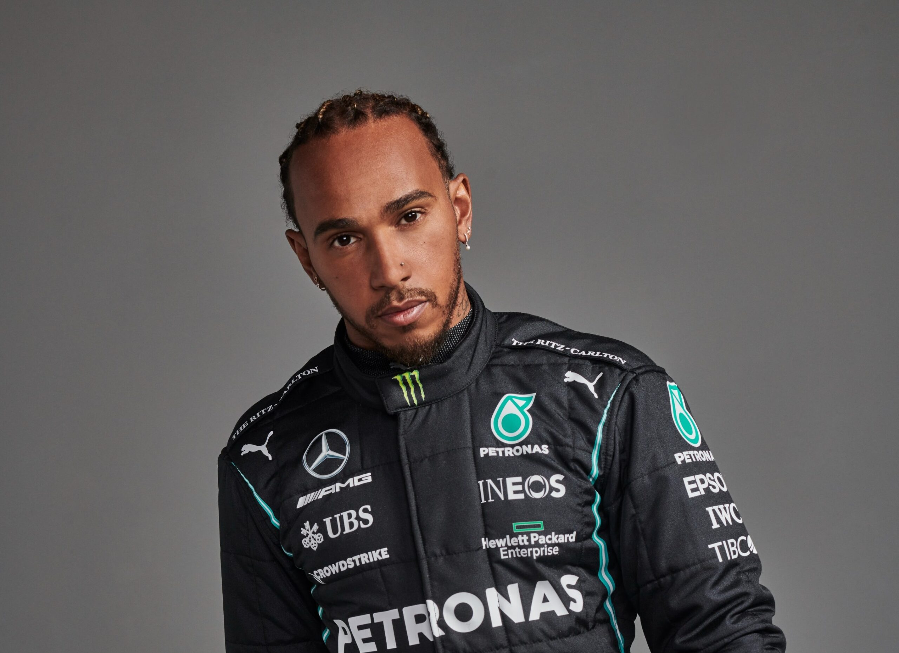

Nationality:  British

Age: 36  

Drives for: [Mercedes](#mercedes)

Very much the GOAT no matter how you look at it. He's already got the most pole positions (98) and race wins (95) in F1 history. He's tied with the great Michael Schumacher for the most Driver's Championships (7) and very likely to break this record in 2021. His one-lap (quali) ability is unrivaled, sometimes seemingly able to "outdrive" what the car is capable of. He hardly makes any mistakes in the race and is literally the god in wet conditions. He's currently the only Black driver on the F1 grid.

### Valtteri Bottas (#77)

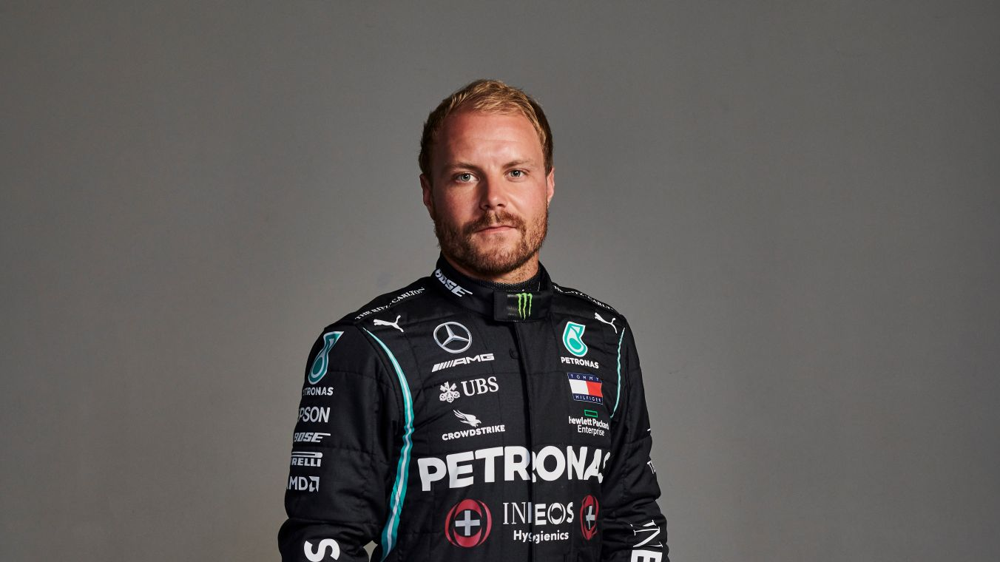

Nationality:  Finnish

Age: 31  

Drives for: [Mercedes](#mercedes)

A typical Finnish character, he's a man of few words or emotions. Also a very decent driver that gets the job done, although not good enough nor consistent enough to challenge his GOAT teammate Hamilton for the whole year. Can pick up a few pole positions and race wins every season because of the dominant Mercedes car.

### Max Verstappen (#33)

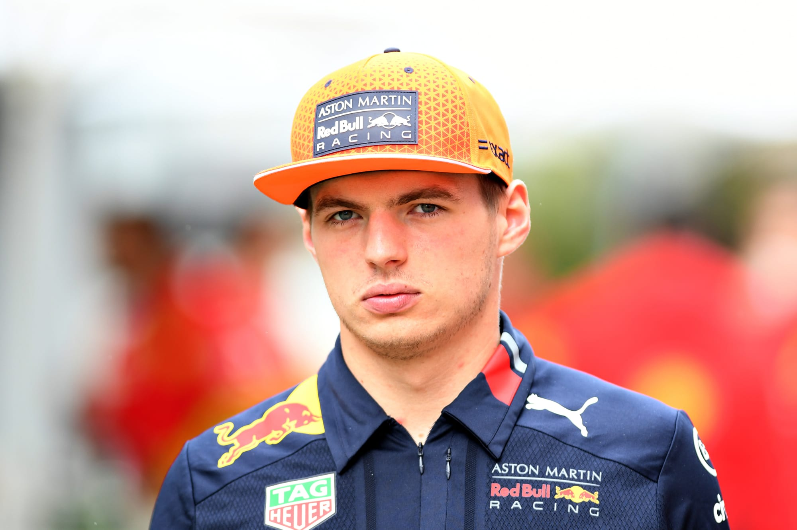

Nationality:  Dutch

Age: 23  

Drives for: [Red Bull Racing](#red-bull-racing)

My favorite driver on the grid. Extremely fierce and talented. Widely considered to be the only driver that could challenge Hamilton if in equal machinery. At such a young age he already has 10 race wins under his belt, all while driving only the 2nd or 3rd best car. He used to be quite impetuous and had a lot of incidents before 2018 but these few years saw him become a much more mature driver, but no less quick and exciting.

Tidbit about Verstappen: He was promoted from Toro Rosso (i.e. the current AlphaTauri) to Red Bull midway in 2016 and immediately went on to win his first race ([2016 Spanish GP](https://www.youtube.com/watch?v=hohuswdeznA)) with Red Bull, becoming the youngest driver ever to win a F1 GP. Truly remarkable.

### Daniel Ricciardo (#3)

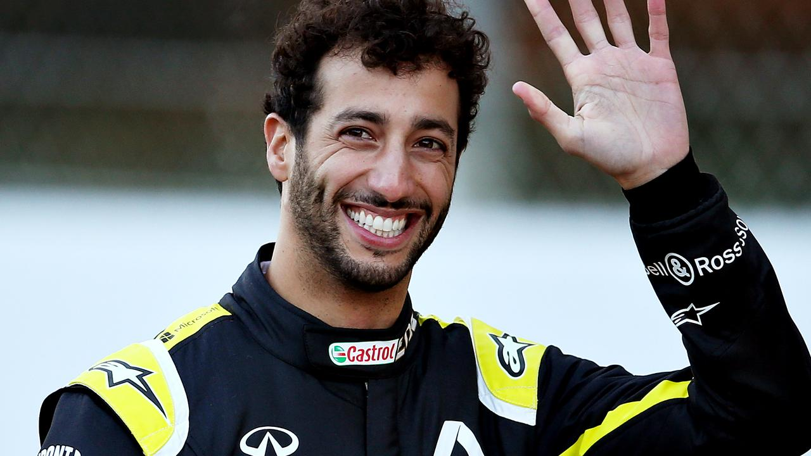

Nationality:  Australian

Age: 31

Drives for: [McLaren](#mclaren)

*That smile. That damned smile.*

Danny Ric is the single most genuinely funny and charismatic person in F1. Nicknamed "the honey badger", he's always friendly and have this giant smile on his face, but on the track turns into a savage predator with relentless pace and unbelievable overtaking skills. He used to be Verstappen's teammate at Red Bull, and among all the teammates Verstappen's ever had, Ricciardo is the only one that can give him a run for his money. In terms of current driving ability, I rank him only behind Hamilton and Verstappen.

Tidbit about Ricciardo: He's a big fan of Austin and the state of Texas. He once used a [Texas Longhorn inspired helmet](https://twitter.com/AlpineF1Team/status/1190016202439086080) when he came to race at the US Grand Prix in Austin.

### Charles Leclerc (#16)

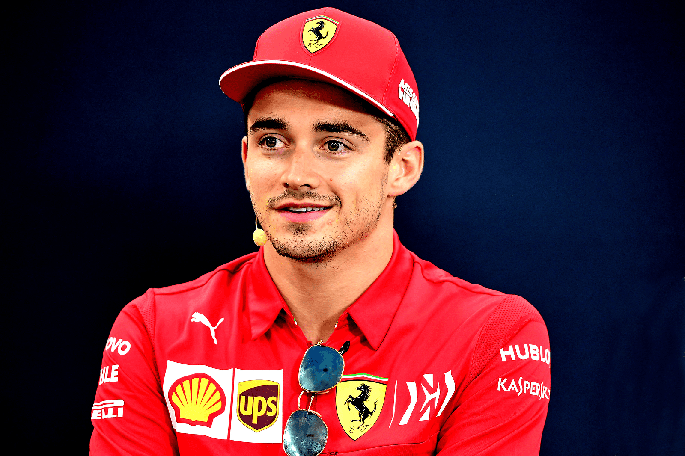

Nationality:  Monégasque

Age: 23

Drives for: [Ferrari](#ferrari)

The young future star of Ferrari. About to enter his 4th year in F1, he is already showing the talent to be a Top-5 driver, with Championship-winning potential if given a good car. In 2020, he completely outperformed his Ferrari teammate, 4-time World Champion Sebastian Vettel. This may be part of the reason why Ferrari decided to part ways with Vettel and go with Leclerc for the long term future.

### Sebastian Vettel (#5)

Nationality:  German

Age: 33

Drives for: [Aston Martin](#aston-martin)

4-time World Champion Sebastian Vettel is one of the most successful drivers in F1 history. He won all his 4 Championships with Red Bull from 2010 to 2013. However, his later tenure with Ferrari from 2015 to 2020 was sweet and sour, without championship success because of the Mercedes dominance. His form gradually declined in the last couple of seasons. He joined Aston Martin this season hoping for a fresh new challenge. He's a very methodical driver and pays much attention to the technical stuff, almost like an engineer.

Tidbit about Vettel: He has a nickname "Inspector Seb" because his habit of peeking at other teams' cars.

### Fernando Alonso (#14)

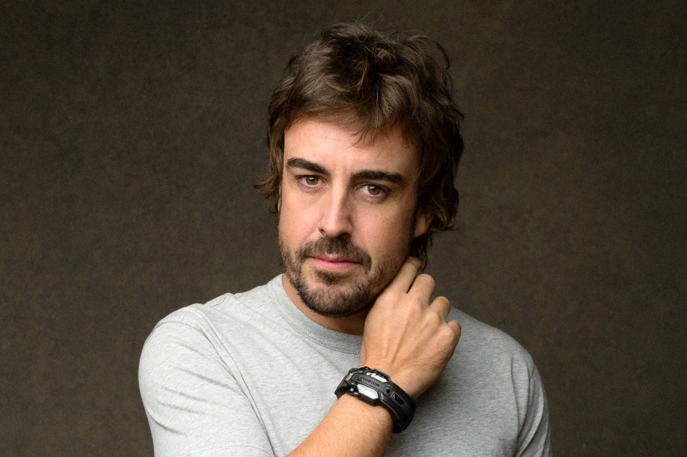

Nationality:  Spanish

Age: 39

Drives for: [Alpine](#alpine)

Veteran driver Alonso is back to F1 after a 2-year hiatus. Previously he won 2 Championships with Renault (the current Alpine team) in 2005 and 2006. He also drove for Ferrari and McLaren later in his career. He is a very talented driver and considered one of the best in F1 history. At his peak during the 2010s he was able to rival Hamilton (they used to be teammates at McLaren).

### Sergio Perez (#11)

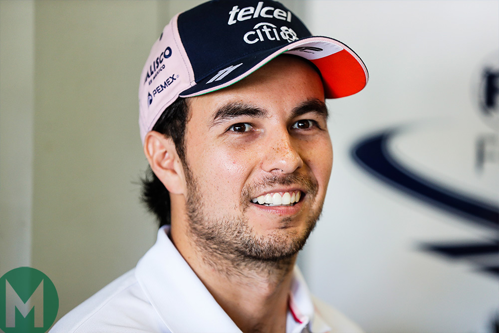

Nationality:  Mexican

Age: 31

Drives for: [Red Bull Racing](#red-bull-racing)

Sergio "Checo" Perez is a very underrated driver. He is known for his great consistency and ability to take care of the tyres. He has been in midfield teams for the entirety of his 10-year F1 career, but was able to score 10 podiums and 1 miraculous race win (['20 Sakhir GP](https://www.youtube.com/watch?v=H0zwR2drgV4)), which tells you how good he is. After being dropped by his former team Racing Point (the current Aston Martin) when they signed Sebastian Vettel, he was at risk of losing an F1 drive before Red Bull signed him to partner Verstappen for 2021. Fans are all really happy for him since this is an opportunity he thoroughly deserves.

### Kimi Raikkonen (#7)

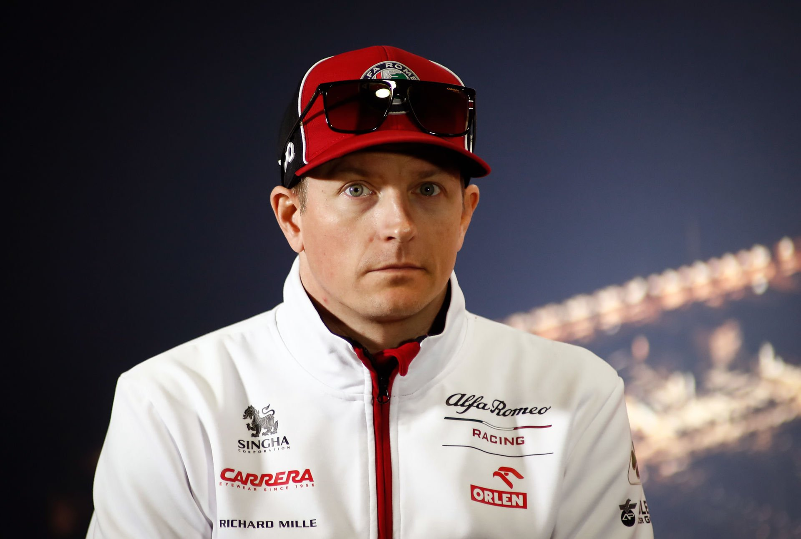

Nationality:  Finnish

Age: 41

Drives for: [Alfa Romeo](#alfa-romeo)

Kimi is currently the oldest driver in F1 and also the most experienced. Nicknamed "the Iceman", he's even more of the reserved, emotionless Finnish character than his fellow countryman Bottas. He is a living walking meme and a legend, simply because he just loves to drive... and [get drunk](https://www.youtube.com/watch?v=gXFxnVeAOVU)... and [enjoy himself](https://www.youtube.com/watch?v=ZMzeluIxblY). All the social media, interviews and PR stuff don't interest him [even the tiniest bit](https://www.youtube.com/watch?v=QjdYTzlfms0). Driving in F1 is [more like a hobby for him](https://www.youtube.com/watch?v=cvQ1J3gCPOg).

Wait wait wait enough with the memes... What adds even more to his legend status is that Kimi is actually the 2007 Ferrari World Champion that I mentioned [earlier](#ferrari), so he was really good in his prime.

### Lando Norris (#4)

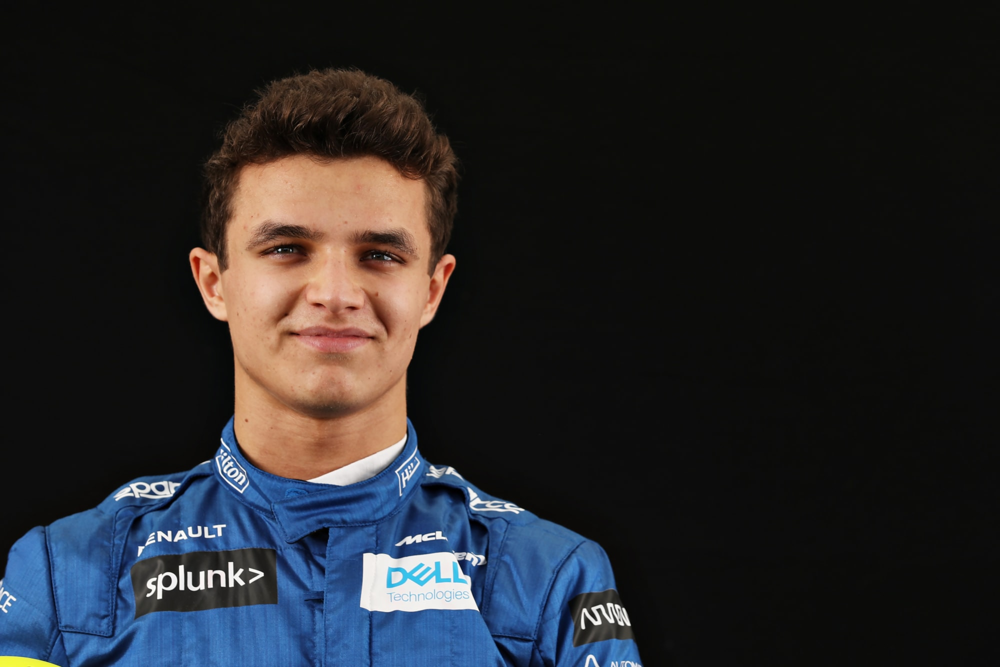

Nationality:  British

Age: 21

Drives for: [McLaren](#mclaren)

Young Lando Norris is another rising talent in the sport. Entering his 3rd year in F1, he's had some pretty decent results with McLaren, highlighted by a sensational podium finish at the ['20 Austrian GP](https://www.youtube.com/watch?v=XgXo0509S28). He's really quick but his consistency can still be improved.

He is immensely popular especially among our generation because he's an avid gamer and streamer on Twitch. He's also a famous shitposter and memelord on Reddit and other social media :) What a driver pairing it is between him and Ricciardo at McLaren!

### George Russell (#63)

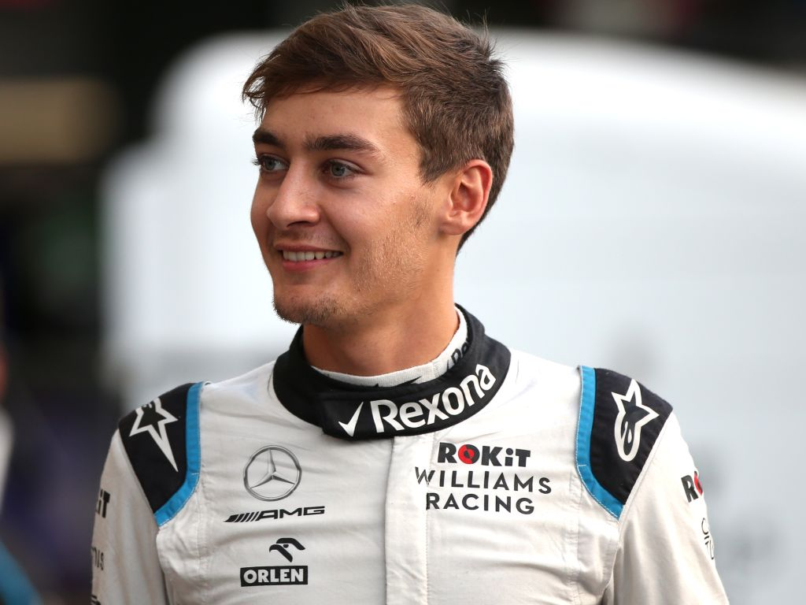

Nationality:  British

Age: 23

Drives for: [Williams](#williams)

Russell is an important character because he is the top prospect in the Mercedes driver development program and is considered to have World-Champion-level talent.  He will very likely take Lewis Hamilton's seat when Hamilton decides to eventually retire or switch teams. Currently driving for backmarker team Williams, results are obviously hard to come by. However, at the ['20 Sakhir GP](https://www.youtube.com/watch?v=eglCFzxWg6U) he substituted for COVID-positive Hamilton  at Mercedes and drove an absolutely flawless race, but was robbed of a sensational victory because of Mercedes' rare strategic blunder. He is a very lovable and funny character, often streaming on Twitch with Norris and Leclerc.

### Pierre Gasly (#10)
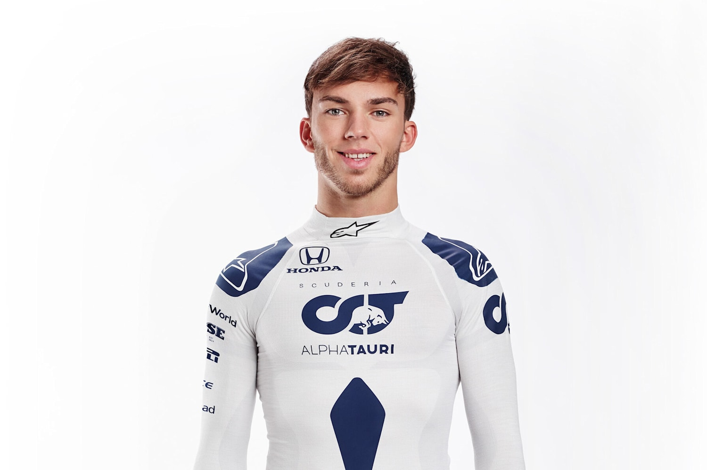

Nationality:  French

Age: 25

Drives for: [AlphaTauri](#alphatauri)

Promoted to Red Bull in 2019, but got demoted back to Toro Rosso/AlphaTauri because of poor performance. However, he recovered his form and confidence at Toro Rosso/AlphaTauri and scored 2 podiums including a [miraculous race win](https://www.youtube.com/watch?v=TB5yhZdF8SI).

### Others

| Picture, Name and Car Number                                 | Nationality                                                  | Team         | Descriptions                                                 |
| :----------------------------------------------------------- | ------------------------------------------------------------ | ------------ | ------------------------------------------------------------ |
| 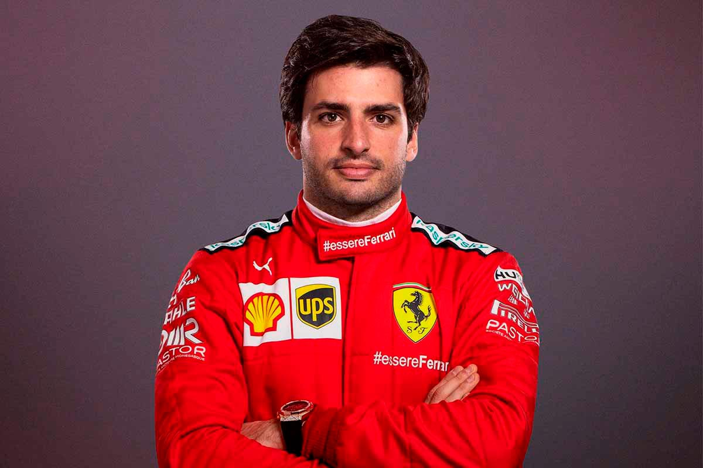Carlos Sainz, Jr. (#55) | Spanish | Ferrari      | 
Ferrari's new driver for 2021. Partnered with Lando Norris at McLaren for the last 2 seasons, with similar results (which is to say, pretty good).
 |
| 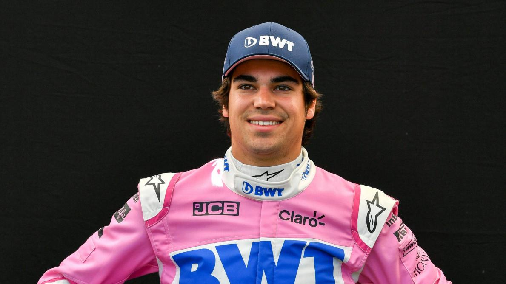Lance Stroll (#18) | Canadian | Aston Martin | 
Son of Aston Martin team owner Lawrence Stroll. An okay young driver.
 |
| 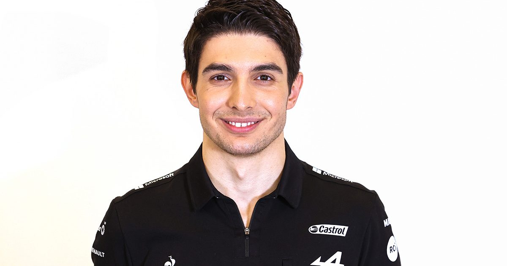Esteban Ocon (#31)  | French | Alpine       | 
Also relatively young (aged 24). A midfield driver in a midfield team.
 |
| 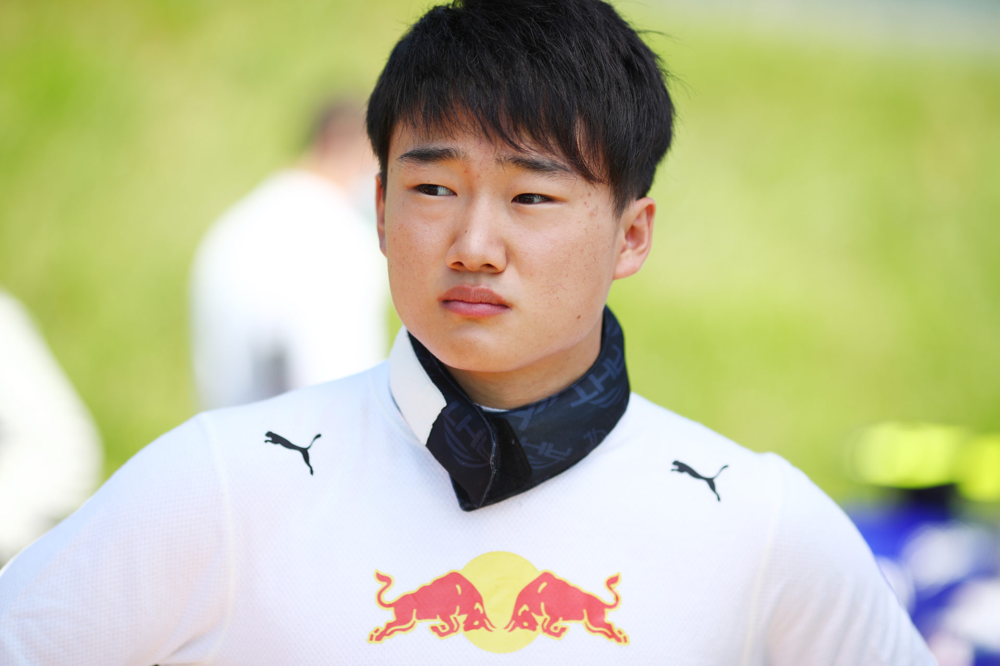Yuki Tsunoda (#22) | Japanese | AlphaTauri   | 
A highly regarded rookie from Japan. Raced in Formula 2 in 2020. Finished 3rd in F2 driver's championship.
 |
| 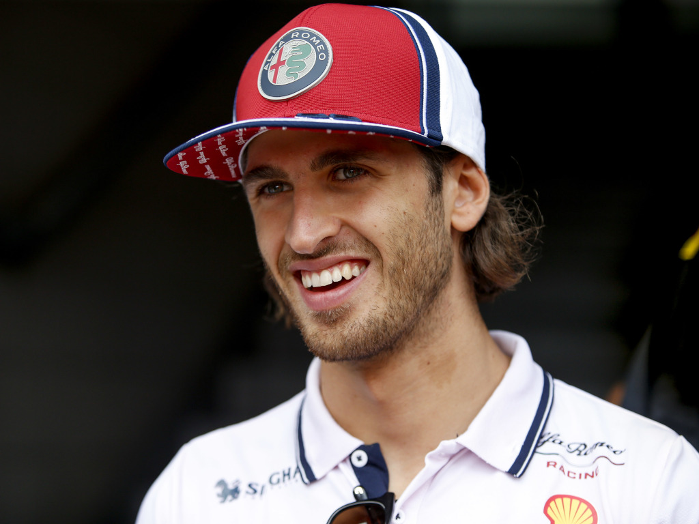Antonio Giovinazzi (#99) |   Italian | Alfa Romeo   | 
Entering 3rd season in F1, no standout performance that I can remember.
 |
| 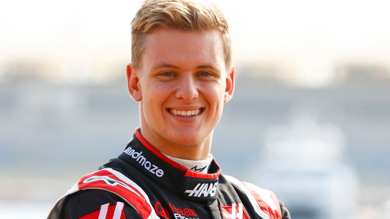Mick Schumacher (#47) | German | Haas         | 
Son of the great Michael Schumacher. Raced and won the driver's championship in Formula 2 in 2020.
 |
| 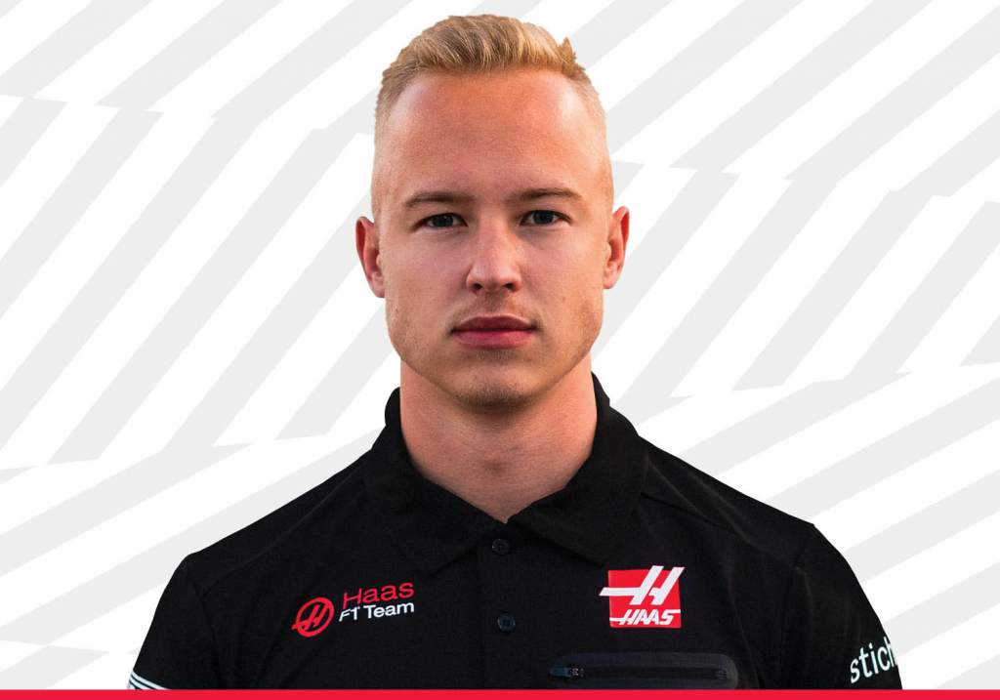Nikita Mazepin (#9) | Russian | Haas         | 
Not only a below average driver in F1, but also a d*ckhead.
 |
| 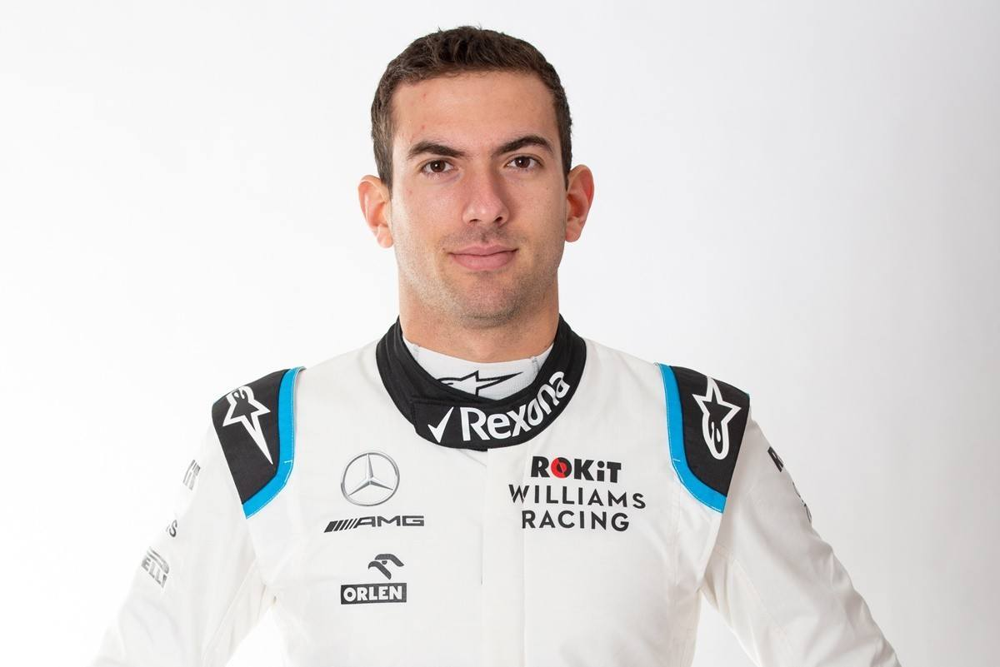Nicholas Latifi (#99) | Canadian | Williams     | 
Not very good, was constantly beaten by more talented teammate George Russell.
 |

### How to Distinguish Drivers in the Same Team

## The Cars

Formula 1 cars are insanely complex and powerful machines. A couple of quick facts:

* F1 cars are able to accelerate from 0 to 100 mph and come to a full stop in only 4 to 5 seconds. They are able to reach max speeds of 230mph.
* F1 cars are so aerodynamic and generate so much [downforce](#downforce-and-dirty-air) that they can (theoretically) drive upside down when up to speed. Nobody ever tested this though, for obvious reasons.

Alright, moving on to the different parts of the car.

### Power Unit

The current F1 power units are 1.6-liter V6 hybrid turbocharged engines. These engines are capable of outputting 900hp, plus an additional 160hp generated by electrical components. The engines idle at around 6000 rpm and reaches a top of 15000 rpm.

The mechanical part of the power unit includes the internal combustion engine and the turbocharger. The electrical part includes an energy recovery system to harvest energy from. The harvested electrical energy is stored in an energy storage (ES), basically the battery, and deployed when the driver needs an extra boost. The control electronics (CE) are also considered part of the power unit.

The power unit is the single most expensive part on the car, costing over $10 million to produce (not development costs!). Due to the significance of power units to the performance of the car, this era (2014-present) where these power units are used is called the **"turbo hybrid era"**. Mercedes dominated this era by having the best power unit on the grid.

Not all teams develop their own PU. There are only 4 engine manufacturers. Teams that develop their own engines are called "works teams". Other teams that buy the power units and use them are "customer teams". Currently, the engine manufacturers and their customers are:

* Mercedes --- Works team: Mercedes; Customer teams: Aston Martin, McLaren, Williams.
* Ferrari --- Works team: Ferrari; Customer teams: Haas, Alfa Romeo.
* Renault --- Works team: Alpine; No customer team.
* Honda --- Developed externally by Honda R&D; Customer teams: Red Bull, AlphaTauri.

A general ranking of engine performances: Mercedes > Ferrari = Renault > Honda. Mercedes engine has always been really good. Ferrari engine regressed compared to a few years ago. Renault and Honda engines has shown improvement and I think their performances are not too far away from Ferrari.

### Tyres

### Bodywork

DRS is a moveable flap in the rear wing that can be triggered to open on specific parts of the track (called DRS zones, usually placed on long straights, out of cornering sections). If the gap between two cars is less than 1 second when approaching the DRS zone, the following car is allowed to use DRS.

## More Technical Concepts

Here are some of the more technical concepts in F1 racing. You can read it if you're curious but it's not absolutely necessary if you just want to understand what's going on and enjoy the race.

### Slipstreaming

Slipstreaming is the act of closely following another car on the straights. You know how the leading car punches a hole in the air so there's less drag for the following car. The following car can get into the slipstream to gain a bit more speed, but there's this issue below ↓

### Downforce and "Dirty Air"

F1 cars require downforce to be able to get around corners. This is the aerodynamic force generated by the wings and other body parts when at high speeds to push the car against the ground so the tyre rubber can work its magic. It is exactly the same principle as the wings of an airplane, just flipped on its back.
Following the car too closely causes the air flow around the car to be disrupted (the air being "dirty") so it loses downforce, which severely affects cornering and braking performance. F1 introduced DRS to try to solve this problem.

### More on DRS

F1 introduced the DRS to mitigate this loss of downforce and to somehow "make up" for lost time in the corners. When DRS is open, air can pass **through** the rear wing instead of **over** it, thus reducing drag. This creates a bit of extra speed (in addition to slipstreaming) for the following car so it can attack the car ahead.

### Understeer and Oversteer

Understeer is when the car doesn't turn into corners very well and runs wide. This is usually associated with the lack of front downforce.

Oversteer is when the car turns too much into a corner and the back end becomes unstable or even swings around. This is usually associated with the lack of rear downforce.

You can set up the wing angles to be steeper to increase downforce at the front or at the back, but then it sacrifices speed on the straights, because a steeper wing angle apparently blocks airflow and creates drag.

### Race Strategy Basics

- **Undercut**  
  Imagine you are stuck behind your rival and couldn't overtake him. You decide to pit **earlier** than your rival, come out with a fresh set of tyres, do a blisteringly fast lap while your rival is struggling on older tyres, and when he eventually does a pitstop you are already in front of him. So you swapped places with him without an on-track overtake.
- **Overcut**  
  Basically the reverse of undercut. You're stuck behind your rival and couldn't overtake him. You decide to pit **later** than your rival. Your rival does his pitstop but couldn't get the new tyres to work immediately, but you managed to squeeze out the final bits of performance on your used set of tyres, so when you eventually complete your pitstop, the lap time differences allowed you to get ahead of your rival without an on-track overtake.

I believe undercuts are generally much more common, mainly because old tyres are generally supposed to be slower than new tyres, but there are lots of factors that affect tyre performance so it's not always the case.

<!-- ## News in the Paddock

Just a bit of recent news to let you know what everyone in the paddock is talking about:

- Arguably the biggest news: F1 will introduce a big overhaul of technical regulations for next season (2022). The cars will look [quite different](https://www.formula1.com/en/latest/article.fia-announce-new-f1-regulations-to-be-delayed-until-2022.1lwtaLmpNcQd0z9SnMEyK8.html). This is mainly to close the performance gaps between the teams and improve the quality of racing. Additionally,
- In the 2021 Season, F1 will trial what's called "sprint qualifying" for three GPs this year. Basically, they want to try out a 1/3 race (100km) to replace traditional qualifying [as previously described](#qualifying).
- Honda will quit F1 after the 2021 season. Red Bull has acquired their engine business to form Red Bull Powertrain, so they can technically be considered as a works team. -->

## More F1-related Content

- Obviously, [r/formula1](https://www.reddit.com/r/formula1/). (Also maybe, [r/formuladank](https://www.reddit.com/r/formuladank/))
- The Netflix show [Drive to Survive](https://www.netflix.com/title/80204890) has attracted a large number of new fans from the US recently. It's really well made, in fact the only reason I subscribe to Netflix for 1 month every year. There's quite a lot of drama, although also some forced and manufactured drama. It covers many more interesting characters and stories in the paddock than what I can include in this guide. All in all a very good show. Season 3 premieres on March 19.
- The official [F1 YouTube Channel](https://www.youtube.com/user/Formula1) is awesome. You got the multi-million dollar production quality, and also the interesting content that fans want to see.
- YouTuber [Chain Bear](https://www.youtube.com/user/chainbearf1) has great videos explaining how everything works in F1, including the technical stuff, race strategy, etc. Love it.
- For all sorts of funny hijinks, go to [Out of Context F1](https://www.youtube.com/channel/UCeL5SSTtkr7xEePMzqHaqZA).
- Some pretty reliable websites and media outlets: [Autosport.com](https://www.autosport.com/), [The Race](https://the-race.com/), [RaceFans.net](https://www.racefans.net/), [Motorsport.com](https://www.motorsport.com/), to name a few. Some articles have paywalls.
