# The Teams

The 10 teams are, of course, where all the stories revolve around. There are the famous ones with a long history such as Ferrari and McLaren, and newcomers (relatively speaking) like Red Bull and Haas. Here is a quick rundown of all the teams.

## The Big Three

### Mercedes

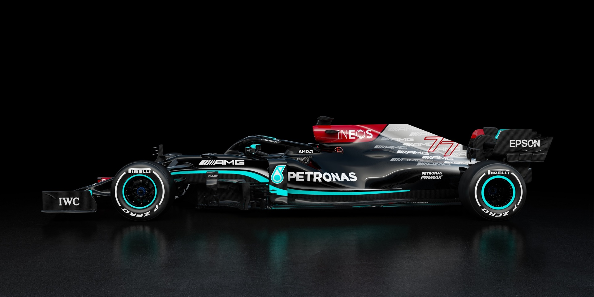

Drivers for 2021: [Lewis Hamilton (#44)](#lewis-hamilton-44), [Valtteri Bottas (#77)](#valtteri-bottas-77)

2020 Constructor's Standing: 1st

The all-conquering, dominant Mercedes team has been the team to beat for the past few years. They are double World Champions (Constructor and Driver) 7 seasons in a row (2014-2020), and are still favorites coming into the 2021 season. They have a superb team that developed the best power units and fastest cars of this era. They have Lewis Hamilton, one of the best drivers in F1 history, to drive for them. It's *almost* like they are unbeatable, since they hardly make any mistakes during the race. However, in the past couple of seasons, a trend seems to be developing that when they actually do make mistakes, they make huge ones, which produced several truly thrilling and memorable races (['19 German GP](https://www.youtube.com/watch?v=RYHQmBULhLc), ['20 Italian GP](https://www.youtube.com/watch?v=TB5yhZdF8SI), ['20 Sakhir GP](https://www.youtube.com/watch?v=H0zwR2drgV4)).

Because of their dominance (and maybe also their black livery) they are often seen as the Darth-Vader-esque villains that everyone wants to beat.

### Ferrari

Drivers for 2021: [Charles Leclerc (#16)](#charles-leclerc-16), Carlos Sainz Jr. (#55)

2020 Constructor's Standing: 6th

The famous red car. Ferrari is the team with the longest history in F1, and also the most success. It's often said that other teams such as Mercedes participate in F1 to help advertise and sell their road cars, but Ferrari sells road cars to fund their participation in F1. Such is their dedication to the sport over the many decades.

For the past dozen years however they haven't had Championship success. They won their last Driver's and Constructor's Champion all the way back in 2007. They were usually able to stay Top-3 in the Constructor's standings, and were even able to challenge Mercedes from 2017 to 2019, but a series of driver errors and strategic mistakes during the race sank their championship hopes.

2020 Season wasn't kind to them as their car performance dropped significantly, mostly because they might have broken the regulations with their power unit and got caught. It's difficult to see them return to Top-3 in the standings in 2021.

### Red Bull Racing

Drivers for 2021: [Max Verstappen (#33)](#max-verstappen-33), [Sergio Perez (#11)](#sergio-perez-11)

2020 Constructor's Standing: 2nd

My favorite team in F1. They are the fun-loving cool guys and mavericks of the F1 grid. Funded by a "fizzy drinks" company, not a lot of people thought they would succeed when they joined F1 in 2005, but they did, winning 4 consecutive double World Champions from 2010 to 2013. Like Ferrari, they were able to stay competitive over the years.

They were unable to challenge Mercedes recently, mostly because of weaker power units, which is not their fault because they did not develop the PUs (more on that [later](technicals.md#power-unit)). Even with a weaker car, they are able to grab race wins from Mercedes or Ferrari because of their excellent execution during the race. They also have a very good young driver's development program which produced multiple star drivers currently on the grid (Verstappen, Vettel, Ricciardo).

## The Midfield

### McLaren

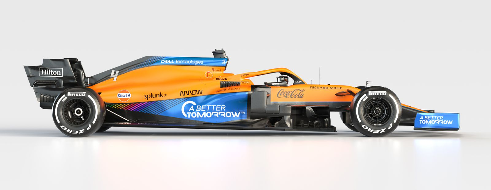

Drivers for 2021: [Daniel Ricciardo (#3)](#daniel-ricciardo-3), [Lando Norris (#4)](#lando-norris-4)

2020 Constructor's Standings: 3rd

McLaren is also one of the more historical teams in F1. Ayrton Senna, Lewis Hamilton and many other Championship-winning drivers used to drive for them. They've had a few really tough years around 2015-2018, but thanks to a major shake up in their team organization and driver changes, they recovered their form in the past two seasons and should continue to improve this year. They currently have an extremely popular driver pairing of Ricciardo and Norris. I consider McLaren my second favorite team and always love to see them do well.

### Aston Martin

Drivers for 2021: [Sebastian Vettel (#5)](#sebastian-vettel-5), Lance Stroll (#18)

2020 Constructor's Standings: 4th

The newly re-branded Aston Martin team went through several ownership changes recently. Previously called Force India (owned by an Indian businessman), then Racing Point for the past couple of seasons after Canadian billionaire Lawrence Stroll took over. Lawrence Stroll then became a major shareholder of the Aston Martin company and decided to turn the Racing Point team into this Aston Martin team.

They have mostly been a decent midfield team, occasionally able to pick up a few podiums. In 2020 they suddenly became quite competitive, but people are quick to notice they borrowed or copied a lot of the design concepts from the 2019 championship-winning Mercedes, earning them a rather funny name of "Tracing Point". They brought in 4-time World Champion, veteran driver Sebastian Vettel for this season, competing alongside Lance Stroll who is the son of Lawrence Stroll. Technically Lance's billionaire dad bought him this F1 seat, but I think Lance is actually an okay driver and people are sometimes too harsh on him.

### Alpine

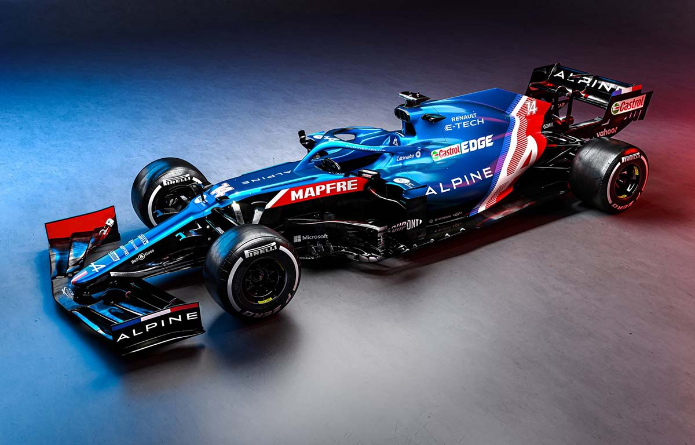

Drivers for 2021: [Fernando Alonso (#14)](#fernando-alonso-14), Esteban Ocon (#31)

2020 Constructor's Standings: 5th

Alpine is basically just Renault. They have been called Renault for most of their history, and only changed the name this year to promote Renault's sports car brand Alpine.

They have had occasional championship success over the years, most notably in 2005-2006 with Fernando Alonso, but most of the time just a midfield team, not too good and not too bad. They should remain in the midfield in 2021.

The one thing I'm really looking forward about Alpine is Guanyu Zhou, a young Chinese driver from Shanghai, is the top prospect in their development system. Zhou currently races in Formula 2, the lower level feeder series of F1. Seems like Alpine is quite determined to get him into F1 in the next few years, because Zhou is a pretty decent driver and can bring tons of sponsor money from China.

### AlphaTauri

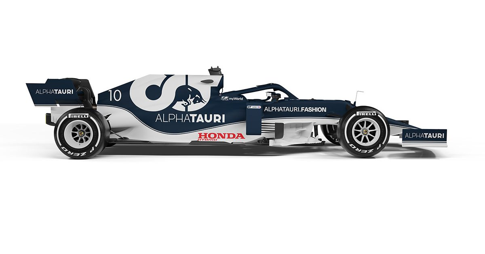

Drivers for 2021: [Pierre Gasly (#10)](#pierre-gasly-10), Yuki Tsunoda (#22)

2020 Constructor's Standings: 7th

AlphaTauri is also owned by the Red Bull group. It is previously called Toro Rosso, which is just "Red Bull" in Italian (the team is based in Faenza, Italy). They can be considered as the junior team to Red Bull. They would put young drivers who graduated from their development program into AT first, and promote to Red Bull if they performed well. Gasly and Tsunoda are both from Red Bull's development program. However, since they are still different teams, Red Bull and AT develop their cars separately, but they do share the same engine manufacturer: Honda. AT (and Toro Rosso previously) never had any championship success, but that's not their main purpose anyway. They did have two miracle race wins which are really great stories (['08 Italian GP](https://www.youtube.com/watch?v=03sUrwIBQb0), ['20 Italian GP](https://www.youtube.com/watch?v=TB5yhZdF8SI)), both are their home races too!

## The Backmarkers

### Alfa Romeo

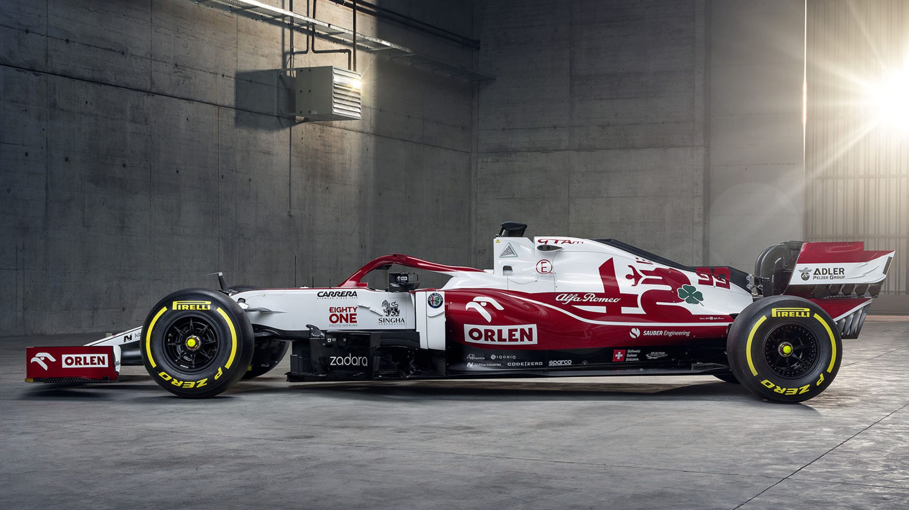

Drivers for 2021: [Kimi Raikkonen (#7)](#kimi-raikkonen-7), Antonio Giovinazzi (#99)

2020 Constructor's Standings: 8th

Alfa Romeo is not the biggest name in F1 and they've not had any championships in the not-so-many seasons they participated. They often run close to the back of the field and are not too much of a focus for the TV cameras. I don't know much about them, but they do have a really pretty livery and a very popular driver Kimi Raikkonen.

### Haas

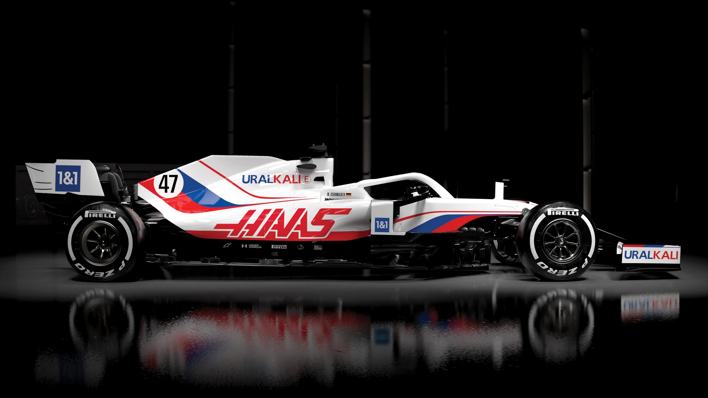

Drivers for 2021: Mick Schumacher (#47), Nikita Mazepin (#9)

2020 Constructor's Standings: 9th

Looking at this huge Russian flag livery you really wouldn't believe me that Haas is an American F1 team, but it is. It's owned by Gene Haas who runs Haas Automation. Haas only has 5 years of history and has not been very successful, but that's not the major talking point about this team. Their previous drivers are often fighting each other, creating much drama and tension. They have a funny-tempered team principal who curses all the time (exhibit [1](https://www.youtube.com/watch?v=W5WVVls74mI) and [2](https://www.youtube.com/watch?v=q6dFnuqHY10)). They have been involved in a couple of really shady sponsorship deals. This year they are going with two rookie drivers which is usually not the best thing to do. Mick Schumacher is the son of the great Michael Schumacher and everybody loves him. Mazepin however, is quite the d*ckhead to say the least, but he is the one bringing all the Russian money which influenced the color scheme of the car. Just... a very weird team.

### Williams

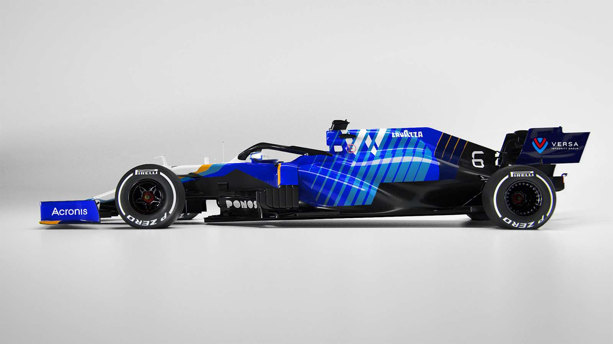

Drivers for 2021: [George Russell (#63)](#george-russell-63), Nicholas Latifi (#6)

2020 Constructor's Standings: 10th

Williams is a very special case. They have a very long and successful history in F1 and widely loved. They are the last traditional, independent  family-run team in F1. British businessman Frank Williams established the team in 1977, then the Williams family ran the team for more than 40 years until August of last year, when a US investment firm acquired the team. The new owners continue to use the Williams name, but the family is no longer involved. Their struggles in recent years have been due to financial losses and insufficient funding, when every other team is bringing in big bucks from outside of F1 as well as building technical partnerships.

They never even once finished in the top-10 during a race in 2020, ending the season with exactly 0 points, which is rather sad for such a historical team. Everyone wants to see them do well, but they still need quite a lot of time to get back on their feet again.

# The Drivers

I feel like one good thing about F1 is that there are not that many people in the paddock that we need to memorize. Additionally, only about 10 drivers are really the main characters, so it's quite easy to develop a strong attachment with every one of them. Here I'll introduce these main characters. For the other ones that are not in the spotlight or that I simply don't know much about, I condensed all of them into one section at the end.

Note: the number behind each driver's name is their car number.

## Lewis Hamilton (#44)

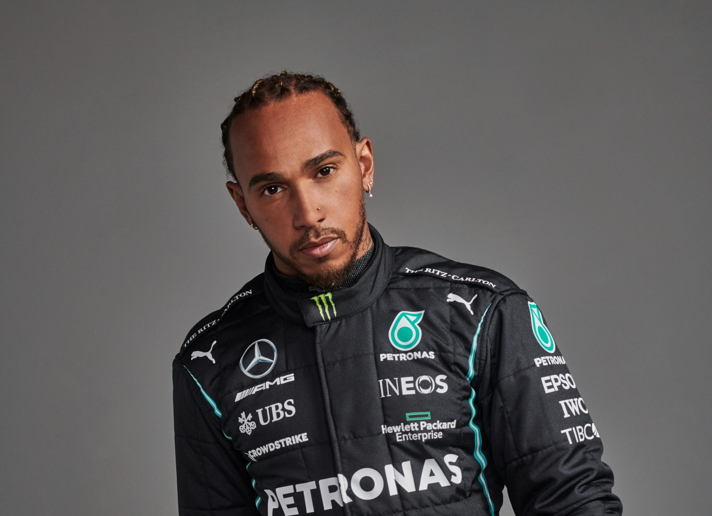

Nationality:  British

Age: 36  

Drives for: [Mercedes](#mercedes)

Very much the GOAT no matter how you look at it. He's already got the most pole positions (98) and race wins (95) in F1 history. He's tied with the great Michael Schumacher for the most Driver's Championships (7) and very likely to break this record in 2021. His one-lap (quali) ability is unrivaled, sometimes seemingly able to "outdrive" what the car is capable of. He hardly makes any mistakes in the race and is literally the god in wet conditions. He's currently the only Black driver on the F1 grid.

## Valtteri Bottas (#77)

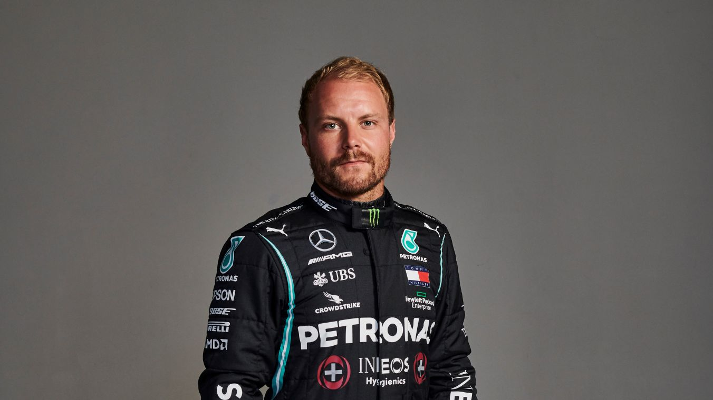

Nationality:  Finnish

Age: 31  

Drives for: [Mercedes](#mercedes)

A typical Finnish character, he's a man of few words or emotions. Also a very decent driver that gets the job done, although not good enough nor consistent enough to challenge his GOAT teammate Hamilton for the whole year. Can pick up a few pole positions and race wins every season because of the dominant Mercedes car.

## Max Verstappen (#33)

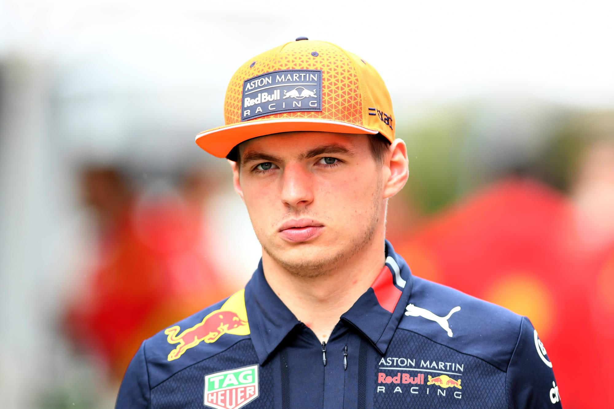

Nationality:  Dutch

Age: 23  

Drives for: [Red Bull Racing](#red-bull-racing)

My favorite driver on the grid. Extremely fierce and talented. Widely considered to be the only driver that could challenge Hamilton if in equal machinery. At such a young age, 2021 will be his **7th (!)** full season in F1. He already has 10 race wins under his belt, all while driving only the 2nd or 3rd best car.

He used to be quite impetuous and had a lot of incidents before 2018 but these few years saw him become a much more mature driver, but no less quick and exciting.

Tidbit about Verstappen: He was promoted from Toro Rosso (i.e. the current AlphaTauri) to Red Bull midway in 2016 and immediately went on to win his first race ([2016 Spanish GP](https://www.youtube.com/watch?v=hohuswdeznA)) with Red Bull, becoming the youngest driver ever to win a F1 GP. Truly remarkable.

## Daniel Ricciardo (#3)

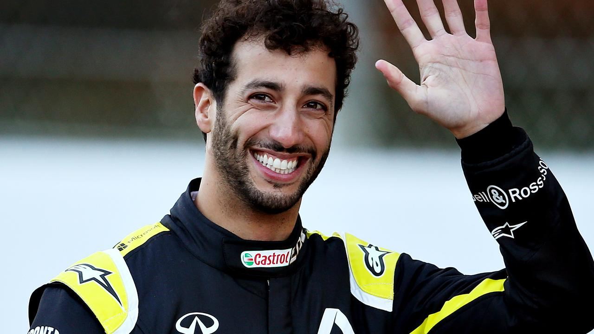

Nationality:  Australian

Age: 31

Drives for: [McLaren](#mclaren)

*That smile. That damned smile.*

Danny Ric is the single most genuinely funny and charismatic person in F1. Nicknamed "the honey badger", he's always the friendly, smiley party animal off the track, but on the track turns into a savage beast with relentless pace and unbelievable overtaking skills.

He used to be Verstappen's teammate at Red Bull, and among all the teammates Verstappen's ever had, Ricciardo is the only one that can give him a run for his money. In terms of current driving ability, I rank him only behind Hamilton and Verstappen.

Tidbit about Ricciardo: He's a big fan of Austin and the state of Texas. He once used a [Texas Longhorn inspired helmet](https://twitter.com/AlpineF1Team/status/1190016202439086080) when he came to race at the US Grand Prix in Austin.

## Charles Leclerc (#16)

Nationality:  Monégasque

Age: 23

Drives for: [Ferrari](#ferrari)

The young future star of Ferrari. About to enter his 4th year in F1, he is already showing the talent to be a Top-5 driver, with Championship-winning potential if given a good car. In 2020, he completely outperformed his Ferrari teammate, 4-time World Champion Sebastian Vettel. This may be part of the reason why Ferrari decided to part ways with Vettel and go with Leclerc for the long term future.

## Sebastian Vettel (#5)

Nationality:  German

Age: 33

Drives for: [Aston Martin](#aston-martin)

4-time World Champion Sebastian Vettel is one of the most successful drivers in F1 history. He won all his 4 Championships with Red Bull from 2010 to 2013. However, his later tenure with Ferrari from 2015 to 2020 was sweet and sour, without championship success because of the Mercedes dominance. His form gradually declined in the last couple of seasons. He joined Aston Martin this season hoping for a fresh new challenge. He's a very methodical driver and pays much attention to the technical stuff, almost like an engineer.

Tidbit about Vettel: He has a nickname "Inspector Seb" because his habit of peeking at other teams' cars.

## Kimi Raikkonen (#7)

Nationality:  Finnish

Age: 41

Drives for: [Alfa Romeo](#alfa-romeo)

Kimi is currently the oldest driver in F1 and also the most experienced. Nicknamed "the Iceman", he's even more of the reserved, emotionless Finnish character than his fellow countryman Bottas. He is a living walking meme and a legend, simply because he just loves to drive... and [get drunk](https://www.youtube.com/watch?v=gXFxnVeAOVU)... and [enjoy himself](https://www.youtube.com/watch?v=ZMzeluIxblY). All the social media, interviews and PR stuff don't interest him [even the tiniest bit](https://www.youtube.com/watch?v=QjdYTzlfms0). Driving in F1 is [more like a hobby for him](https://www.youtube.com/watch?v=cvQ1J3gCPOg).

Wait wait wait enough with the memes... What adds even more to his legend status is that Kimi is actually the 2007 Ferrari World Champion that I mentioned [earlier](#ferrari), so he was really good in his prime.

## Lando Norris (#4)

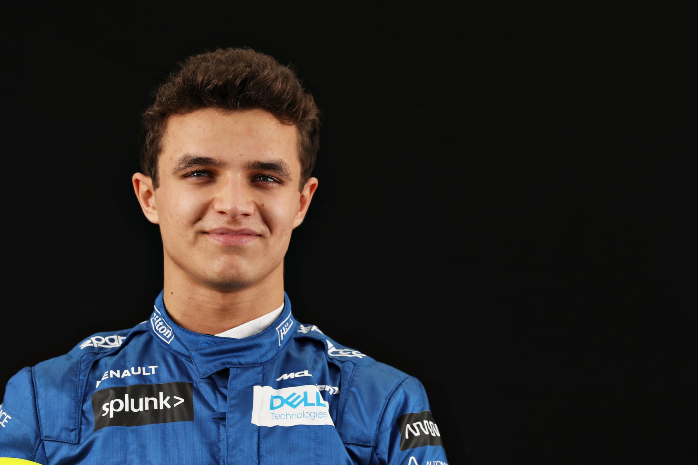

Nationality:  British

Age: 21

Drives for: [McLaren](#mclaren)

Young Lando Norris is another rising talent in the sport. Entering his 3rd year in F1, he's had some pretty decent results with McLaren, highlighted by a sensational podium finish at the ['20 Austrian GP](https://www.youtube.com/watch?v=XgXo0509S28). He's really quick but his consistency can still be improved.

He is immensely popular especially among our generation because he's an avid gamer and streamer on Twitch. He's also a famous shitposter and memelord on Reddit and other social media.

## Sergio Perez (#11)

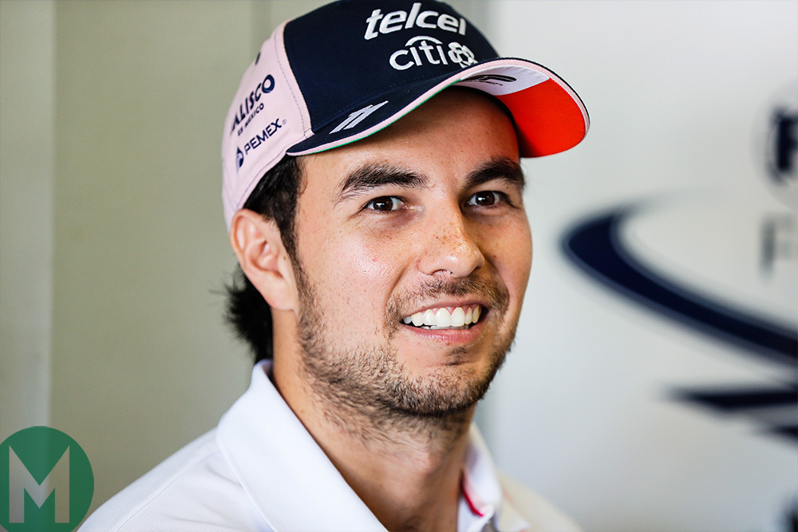

Nationality:  Mexican

Age: 31

Drives for: [Red Bull Racing](#red-bull-racing)

Sergio "Checo" Perez is a very underrated driver. He is known for his great consistency and tyre management ability. He has been in midfield teams for the entirety of his 10-year F1 career, but was able to score 10 podiums including 1 miraculous race win (['20 Sakhir GP](https://www.youtube.com/watch?v=H0zwR2drgV4)), which tells you how good he is. After being dropped by his former team Racing Point (the current Aston Martin) when they signed Sebastian Vettel, he was at risk of losing an F1 drive before Red Bull signed him to partner Verstappen for 2021. Fans are all really happy for him since this is an opportunity he thoroughly deserves.

## Fernando Alonso (#14)

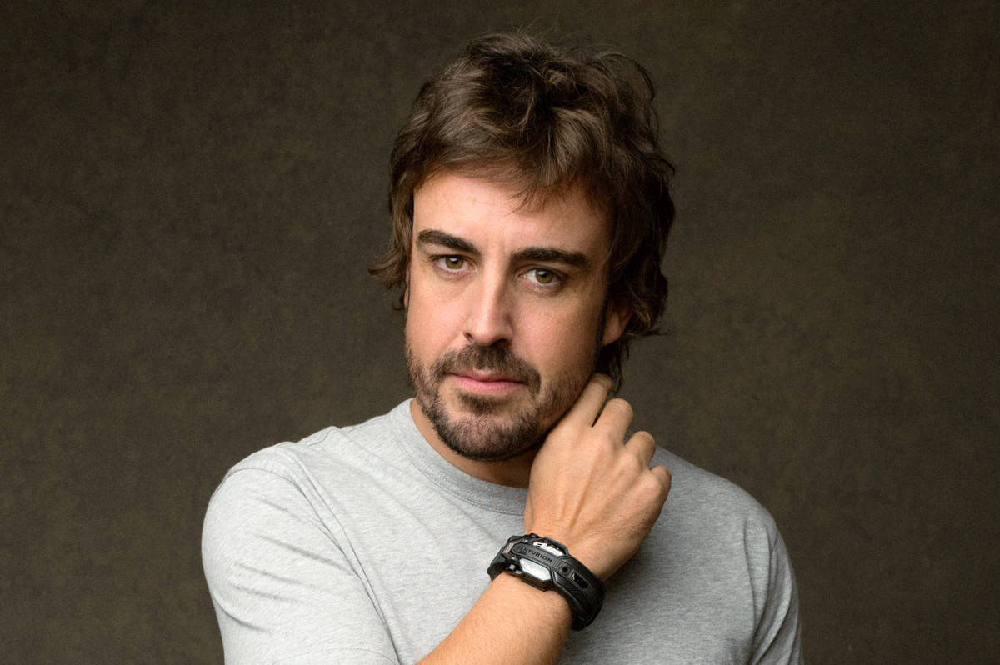

Nationality:  Spanish

Age: 39

Drives for: [Alpine](#alpine)

Veteran driver Alonso is back to F1 after a 2-year hiatus. Previously he won 2 Championships with Renault (the current Alpine team) in 2005 and 2006. He also drove for Ferrari and McLaren later in his career. He is a very talented driver and considered one of the best in F1 history. At his peak during the 2010s he was able to rival Hamilton (they used to be teammates at McLaren).

## George Russell (#63)

Nationality:  British

Age: 23

Drives for: [Williams](#williams)

Russell is an important character because he is the top prospect in the Mercedes driver development program and is considered to have World Champion level talent. He will very likely take Lewis Hamilton's seat when Hamilton decides to eventually retire or switch team.

Currently driving for backmarker team Williams, results are obviously hard to come by. However, at the ['20 Sakhir GP](https://www.youtube.com/watch?v=eglCFzxWg6U) he substituted for COVID-positive Hamilton at Mercedes and drove an absolutely flawless race, but was robbed of a sensational victory because of Mercedes' rare strategic blunder.

He is quite a lovable and funny character, often streaming on Twitch with Norris and Leclerc.

## Pierre Gasly (#10)
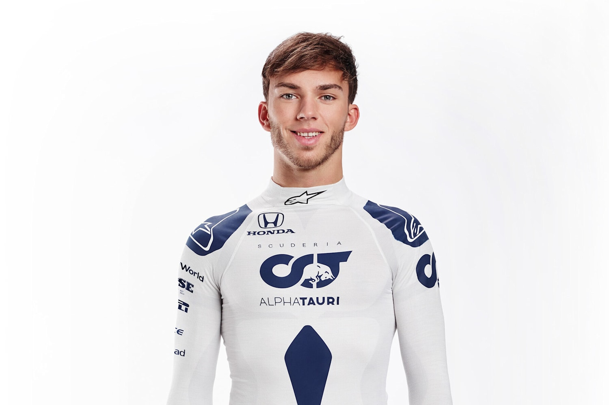

Nationality:  French

Age: 25

Drives for: [AlphaTauri](#alphatauri)

Promoted to Red Bull in 2019, but got demoted back to Toro Rosso/AlphaTauri because of poor performance. However, he recovered his form and confidence at Toro Rosso/AlphaTauri and scored 2 podiums including a miraculous race win at the ['20 Italian GP](https://www.youtube.com/watch?v=TB5yhZdF8SI).

## Others

| Picture, Name and Car Number                                 | Nationality                                                  | Team         | Descriptions                                                 |
| :----------------------------------------------------------- | ------------------------------------------------------------ | ------------ | ------------------------------------------------------------ |
| Carlos Sainz, Jr. (#55) | Spanish | Ferrari      | 
Ferrari's new driver for 2021. Partnered with Lando Norris at McLaren for the last 2 seasons, with similar results (which is to say, pretty good).
 |
| 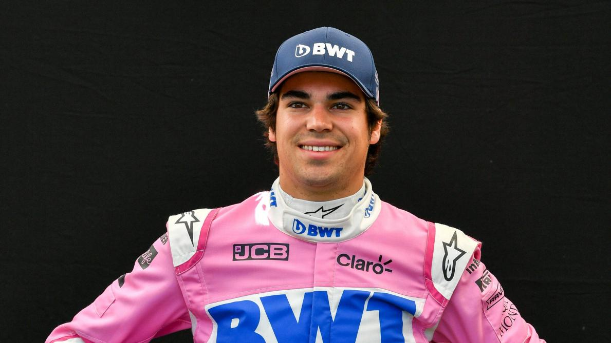Lance Stroll (#18) | Canadian | Aston Martin | 
Son of Aston Martin team owner Lawrence Stroll. An okay young driver.
 |
| 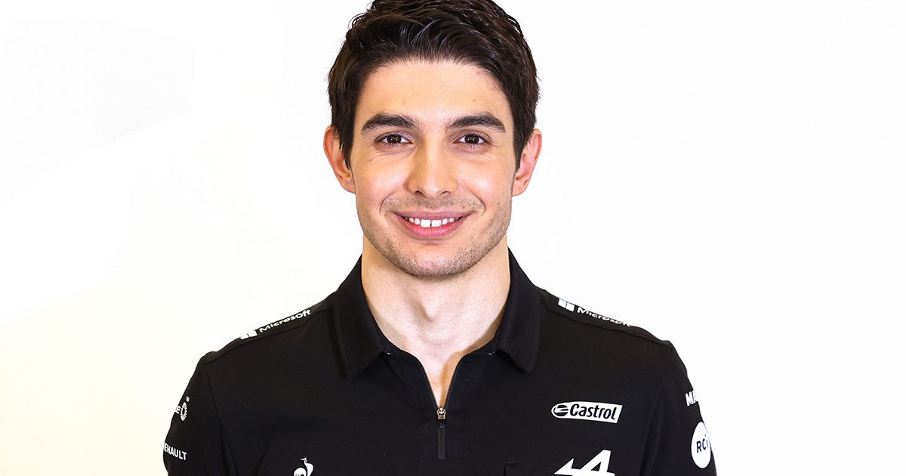Esteban Ocon (#31)  | French | Alpine       | 
Also relatively young (aged 24). A midfield driver in a midfield team.
 |
| 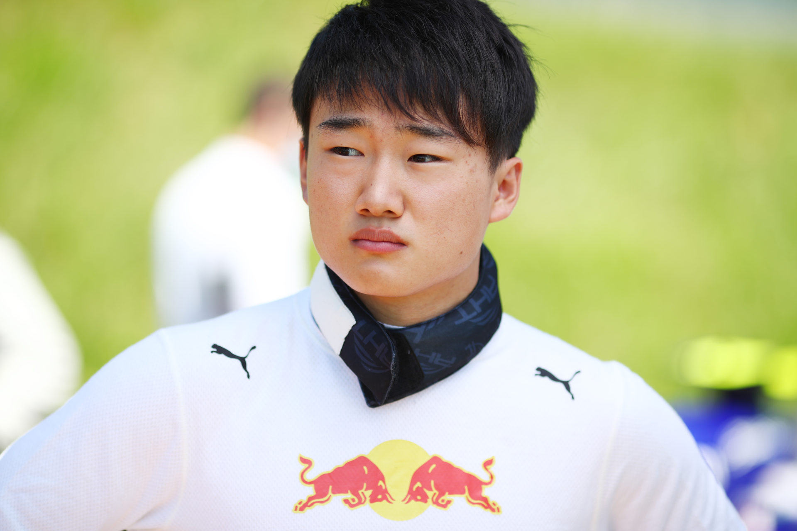Yuki Tsunoda (#22) | Japanese | AlphaTauri   | 
A highly regarded rookie from Japan. Raced in Formula 2 in 2020. Finished 3rd in F2 driver's championship.
 |
| 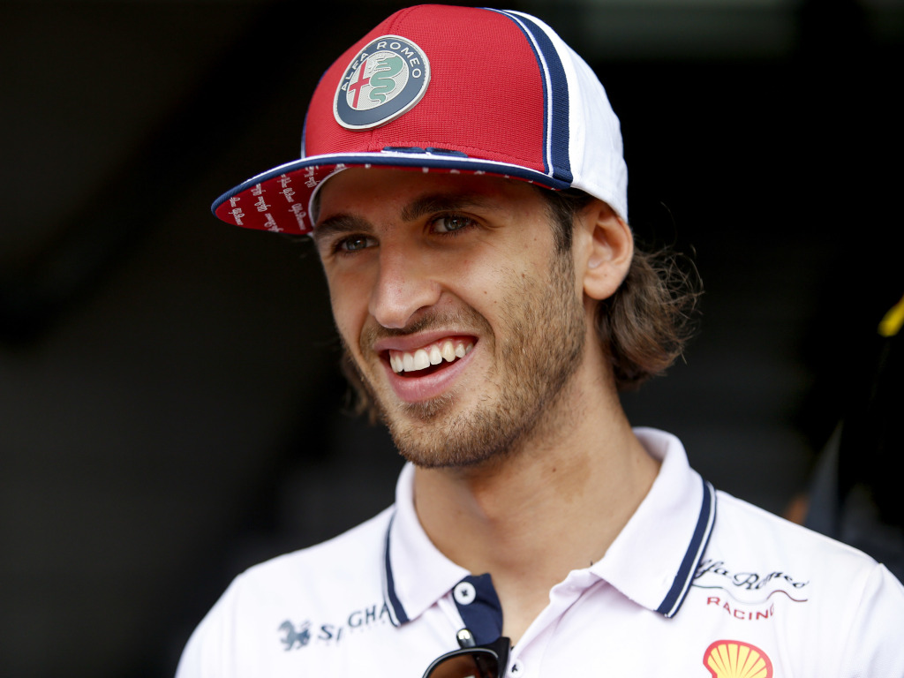Antonio Giovinazzi (#99) |   Italian | Alfa Romeo   | 
Entering 3rd season in F1, no standout performance that I can remember.
 |
| Nicholas Latifi (#99)  |  Canadian | Williams  | 
Not very good, was constantly beaten by more talented teammate George Russell.
  |
| Mick Schumacher (#47) | German | Haas         | 
Son of the great Michael Schumacher. Raced and won the driver's championship in Formula 2 in 2020.
 |
| 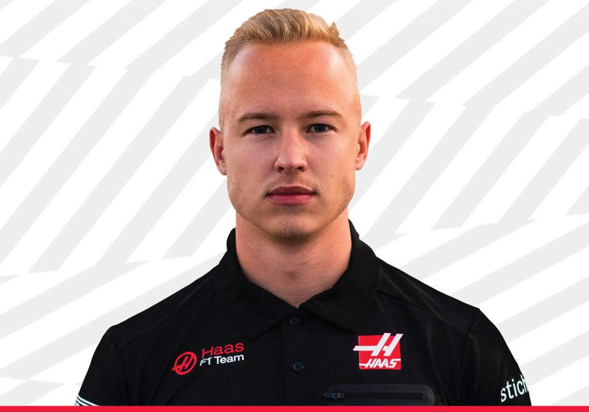Nikita Mazepin (#9) | Russian | Haas         | 
F1 rookie. He's a pretty dirty driver and a terrible person, but his dad got the $$$ so there's that.
 |

## How to Distinguish Drivers in the Same Team
Since the two cars of the same team use the same livery, it's a bit difficult to distinguish the drivers during a live race broadcast. The biggest difference is the color of the television camera pods (T-cam) at the top of the cars.

Traditionally, the more experienced teammate uses a black T-cam, and the less experienced or newcomer to the team uses a yellow T-cam, but there are of course exceptions. The full list is shown below:

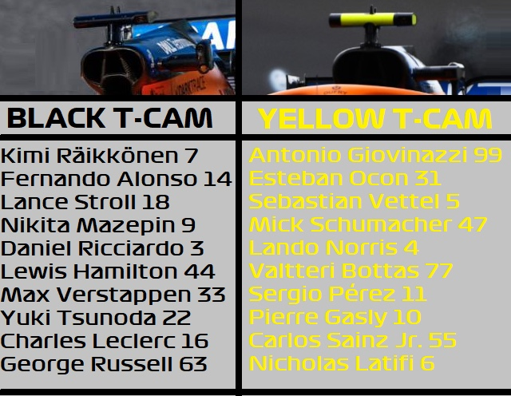
