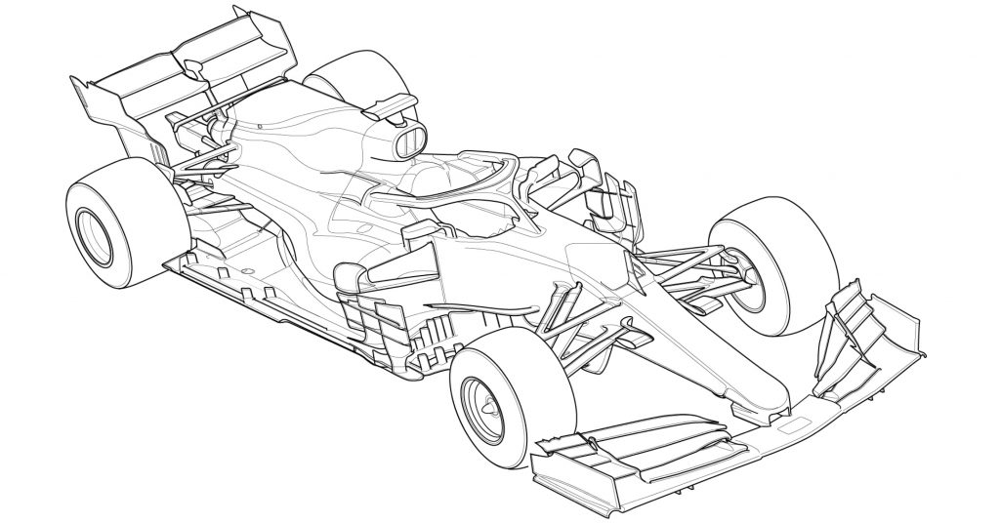
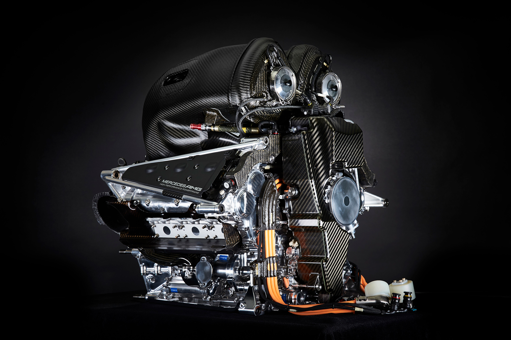
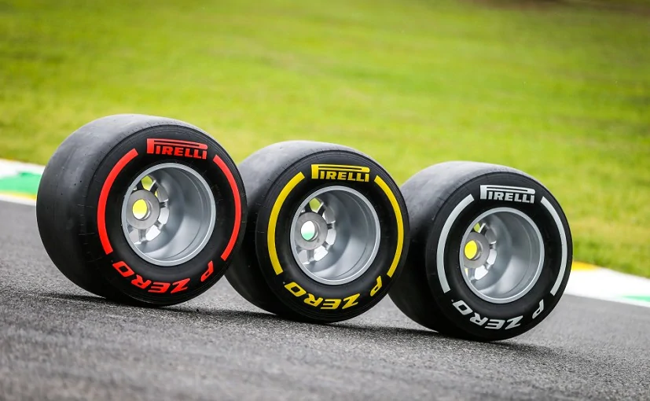
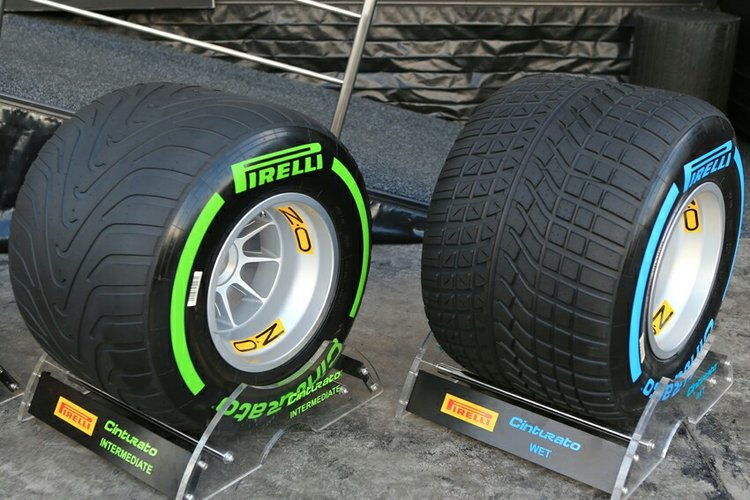
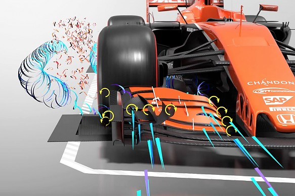
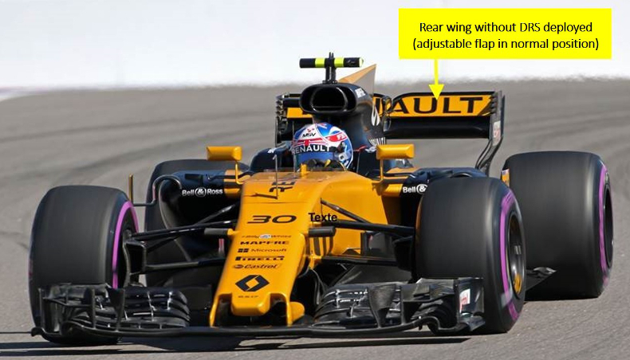
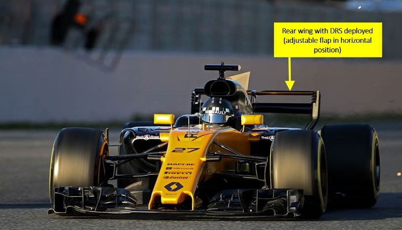
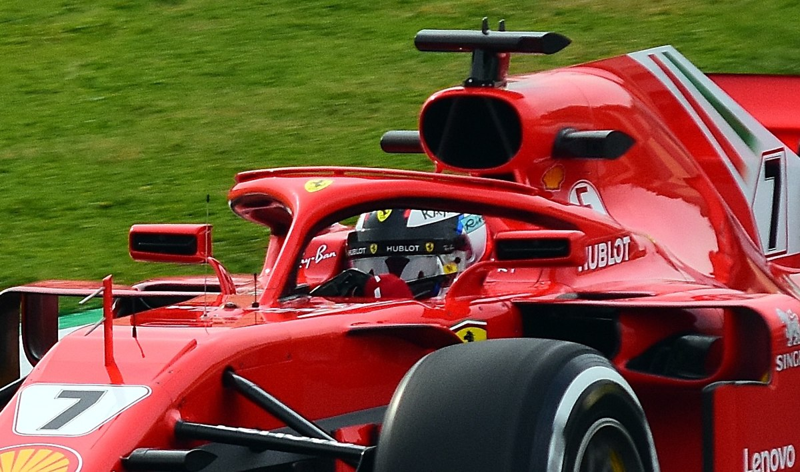
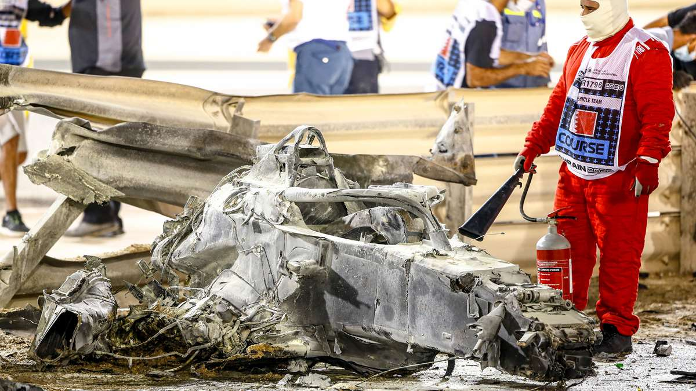

# The Cars

People not familiar with motorsports may think how it can be considered a physical "sport". The truth is, Formula 1 cars are insanely complex and powerful machines which takes incredible stamina, strength and reflexes to be able to operate, let alone drive to the limit. With all these requirements on fitness, F1 drivers are more like fighter pilots and astronauts than your typical athlete.

* F1 cars are able to accelerate from 0 to 100 mph and come to a full stop in only 4 to 5 seconds. They are able to reach top speeds of 230mph.
* F1 cars are so aerodynamic and generates so much downforce and grip that they can theoretically run on the ceiling and not fall off. Because of this, their cornering speeds are significantly higher than any other racing car in the world.
* Due to the aerodynamics and immense power, F1 cars can develop up to 6 G's of longitudinal or lateral acceleration when braking, accelerating or cornering. The best sports cars such as Bugattis can only develop 1.5 G's of acceleration in comparison.
* The forces exerted on a driver's body, especially the neck area, can be up to 150 lb. Imagine the body taking this much of a pounding for 1.5 to 2 hours non-stop. If you look at drivers' pictures you can clearly see their necks are almost as wide as their heads. They literally drive at breakneck (_Ba-dum tss!_) speeds.

Alright, moving on to the different parts of the car, to let you know a little bit more about how all these are possible.

## Power Unit

The current F1 power units are 1.6-liter V6 hybrid turbocharged engines. These engines are capable of outputting 900hp, plus an additional 160hp generated by electrical components. In addition, the minimum weight allowed for F1 cars is 740 kg (1,631 lb), the power-to-weight ratio is quite stupidly insane. The engines idle at around 6000 rpm and reaches a top of 15000 rpm.

The mechanical part of the power unit includes the internal combustion engine and the turbo. The electrical part includes an energy recovery system to harvest kinetic energy and heat generated from the normal running of the car. The harvested energy is stored in an energy storage (essentially the battery), and deployed when the driver needs an extra boost and pushes an "overtake" button on the steering wheel.

The power unit is the single most expensive part on the car, costing over $10 million to produce (not development costs!). Due to the significance of power units to the performance of the car, this era (2014-present) where these power units are used is called the **"turbo hybrid era"**. Mercedes dominated this era by having the best power unit on the grid.

Not all teams develop their own PU. There are only 4 engine manufacturers. Teams that develop their own engines are called "works teams". Other teams that buy the power units and use them are "customer teams". Currently, the engine manufacturers and their customers are:

* Mercedes --- Works team: Mercedes; Customer teams: Aston Martin, McLaren, Williams.
* Ferrari --- Works team: Ferrari; Customer teams: Haas, Alfa Romeo.
* Renault --- Works team: Alpine; No customer team.
* Honda --- Developed externally by Honda; Customer teams: Red Bull, AlphaTauri.

A general ranking of engine performances: Mercedes > Ferrari = Renault > Honda. Mercedes engine has always been really good. Ferrari engine regressed compared to a few years ago. Renault and Honda engines has shown improvement and I think their performances are not too far away from Ferrari.

## Tyres

Tyres are critical because they are the only parts of the car to have direct contact with the track. While driving the cars:

* You always want the tyres to have as much surface area gripping on the track to maximize acceleration, braking and cornering performances. The tyres should also have a smooth, round surface so it contacts the track at all times without interruption. This is even considering that the track is not flat. F1 tracks have a lot of elevation changes, so it's difficult to have the tyres work well around the entire lap.
* You want to keep the tyres in a good "working window". This means that the tyres need to be operating at suitable temperatures for the rubber to be grippy and not slippery. However, it requires constant fine-tuning because of different track surface abrasion characteristics, air and track temperature, among many other factors. Drivers constantly adjust their driving to maintain the temperature in the tyres.
* You want to keep track of the sets of tyres that you have. Each driver is allocated a limited number of tyre sets for every race weekend, so you must carefully manage and protect the tyres to gain an upper hand in the race.

Pirelli is the official tyre provider of F1. They produce 5 different types of dry tyres, called "slicks", and 2 different types of wet-condition tyres.

### Dry/Slicks

Slick tyres have smooth surfaces and are used in dry conditions.

The 5 slick tyres use 5 different rubber compounds, essentially different chemical constructions, that affects the performance and life of the tyres. If the compound is softer, it is more grippy and runs quicker, but the tyre life would be shorter. Conversely, if the compound is harder, then it will run for longer, but it will be less grippy and slower. The compounds ranked from hardest to softest are called C1 to C5 respectively.

However, for each race weekend, you only see 3 compounds used, which are called "Hard", "Medium", and "Soft". This is because Pirelli only brings 3 of the 5 dry compounds to each GP, but the compound choices are different for different GPs. For example, they choose to use compounds C1 to C3 for the British GP, then C1 = Hard, C2 = Medium, C3 = Soft; then for the Monaco GP, they go with C3 to C5 instead, then C3 = Hard, C4 = Medium, C5 = Soft.

For the same race weekend, **Hard tyres = white sidewalls, Medium = yellow sidewalls, Soft = red sidewalls**. Shown below:

An important rule about slick tyres is that if a race is dry, each driver **must use at least 2 of the 3 dry compounds during the race**. This essentially means you must do at least one pitstop, and forces the teams to think about which compounds to use.

A very simple example, teams may choose to do a 2-stop race using the soft and medium tyres, or a 1-stop race using the medium and hard tyres. Pitstops cost time and track position so they'll have to make it up by using softer tyres.

### Wets

There are two types of wet-condition tyres, the Intermediates, and the Full-Wets. You can notice they are different from the slick tyres because they have grooves on them. The grooves are used to evacuate water. You can imagine without the grooves, the tyres will not stick to the wet track and starts aquaplaning.

Intermediates have shallow, symmetrical grooves, they are typically used on a damp track with no standing water. Full-Wets have deep and non-symmetrical grooves, they are only used in heavy rain conditions.

**Intermediates = green sidewalls. Full-Wets = blue sidewalls.** Shown below:

## Wings/Bodywork

One of the most noticeable features of F1 cars are their substantial front and rear wings, as well as all kinds of little bits and pieces of aero sticking out of every part of the car. Almost every part of the bodywork is hand-made with carbon fiber. This is usually where teams spend tens of millions of dollars every single year to try to eke out a few tenths of a second of performance per lap.

Aerodynamics are extremely sensitive to the slightest of changes in temperature and airflow. Every single piece of bodywork serves a purpose. I know that teams go to such extremes that they have to take the _wobbling of the tyre rubber_ into account when designing the wings and bodywork. Just incredibly intricate and complex stuff.

The main purposes of the wings and bodywork are 1. to increase downforce, and 2. to decrease drag. I added a bit of explanation about these [later](#more-technical-concepts).

There is one important concept worth mentioning, which is the **Drag Reduction System (DRS)**. DRS is a moveable flap in the rear wing that can be triggered to open on specific parts of the track (called DRS zones, usually placed on long straights, out of cornering sections). If the gap between two cars is less than 1 second when approaching a DRS zone, the following car is allowed to use DRS. I explained a bit more about DRS [here](#more-on-drs).

## The Halo

The halo is a safety device introduced in 2018 to protect the driver's head and neck area from possible impact. As you can see from the picture, it's the Y-shaped bar that's surrounding the driver's head. It's made of titanium and weighs 20 lbs. The halo is the strongest piece of structure on the car, and it can "take the weight of a London double-decker bus sitting on top", to quote Mercedes technical director James Allison.

It was controversial at first because it messed with the overall look of the car and fans are not happy about it. However, over just the past 3 years it has already played important roles in preventing serious head injuries to drivers or even death --- You might have seen this horrific crash in the news, when French driver Romain Grosjean went off the track and ploughed _through_ the barrier, causing the car to snap in half and created a huge inferno. The halo served as a wedge to split the barriers. Without the halo, it would be Grosjean's head making contact and he might not survive. Fortunately he came out of the incident with only burns on his hands and feet.

# More Technical Concepts

Here are some of the more technical concepts in F1 racing. You can read it if you're curious but it's not absolutely necessary if you just want to understand what's going on and enjoy the race.

## Slipstreaming

Slipstreaming is the act of closely following another car on the straights. You know how the leading car punches a hole in the air so there's less drag for the following car. The following car can get into the slipstream to gain a bit more speed, but there's this issue below ↓

## Downforce and "Dirty Air"

F1 cars require downforce to be able to get around corners. This is the aerodynamic force generated by the wings and other body parts when at high speeds to push the car against the ground so the tyre rubber can work its magic. It is exactly the same principle as the wings of an airplane, just flipped on its back.

Following the car too closely causes the air flow around the car to be disrupted (the air being "dirty") so it loses downforce, which severely affects cornering and braking performance. F1 introduced DRS to try to solve this problem.

## More on DRS

F1 introduced the DRS to mitigate this loss of downforce and to somehow "make up" for lost time in the corners. When DRS is open, air can pass **through** the rear wing instead of **over** it, thus reducing drag. This creates a bit of extra speed (in addition to slipstreaming) for the following car so it can attack the car ahead.

## Understeer and Oversteer

Understeer is when the car doesn't turn into corners very well and runs wide. This is associated with the lack of front grip.

Oversteer is when the car turns too much into a corner and the back end becomes unstable or even swings around. This is usually associated with the lack of rear grip.

A team can set up the wing angles to be steeper to increase downforce either at the front or the back to improve grip, but then it sacrifices speed on the straights, because a steeper wing angle apparently blocks airflow and creates drag. A team may also try to tweak the suspension geometry to adjust the contact patch of the tyres to the ground, but it also creates a similar trade-off situation like the wing angles.

## Race Strategy Basics

- **Undercut**  
  Imagine you are stuck behind your rival and couldn't overtake him. You decide to pit **earlier** than your rival, come out with a fresh set of tyres, do a blisteringly fast lap while your rival is struggling on older tyres, and when he eventually does a pitstop you are already in front of him. So you swapped places with him without an on-track overtake.
- **Overcut**  
  Basically the reverse of undercut. You're stuck behind your rival and couldn't overtake him. You decide to pit **later** than your rival. Your rival does his pitstop but couldn't get the new tyres to work immediately, but you managed to squeeze out the final bits of performance on your used set of tyres, so when you eventually complete your pitstop, the lap time differences allowed you to get ahead of your rival without an on-track overtake.

I believe undercuts are generally much more common, mainly because old tyres are usually supposed to be slower than new tyres, but there are lots of factors that affect tyre performance so it's not always the case.
